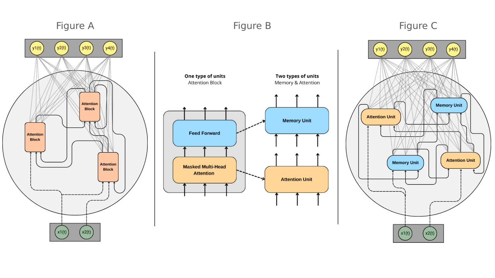

# Recurrent Attention Network

Yannis Bendi-Ouis, Xavier Hinaut
Mnemosyne, Inria, Bordeaux, France

With the recent success of Transformers in the field of automatic natural language processing [1], it has become clear that we are able to create complex, high-performance neural network architectures that can extract, combine and transform information to meet a specific objective, such as predicting the next word in a text.

However, to function, Transformers need to receive a context of all N elements of the past sequence (N = 2k to 32k tokens) at each time step, causing the number of computations to grow quadratically (N^2) with the length of the sequence [1].

This "perfect" memory of a context of thousands of elements is equivalent in neuroscience to a biologically unrealistic working memory. In order to be more biologically plausible, we propose to drastically reduce the size of this context (allowing more local and less costly computations), while introducing recurrences allowing the use of a longer-term working memory.

An efficient and biologically plausible way to have recurrences is to place oneself in the Reservoir Computing paradigm [2], where the recurrent connections are random and the output layer serves as a readout trained by linear regression (or equivalence). For computational neuroscience, Reservoir Computing is a very interesting approach for modeling high-dimensional non-linear computations with low computational complexity.

Unlike other approaches that seek to modify the calculations behind attention (RWKV [5], RetNet [6]), we propose to combine these two models so as to benefit from both the attentional computations of Transformers and the working memory of Reservoir Computing.

In the same way that dendritic computations [4] show us that neurons are capable of more complex computations, we believe that it may be interesting to replace the neurons (tanh unit) present in a Reservoir with more complex units, such as the attention blocks present in Transformers, even for a short period of time.

We are evaluating two new architectures on a set of sequential tasks (e.g. SequentialMnist): one containing units equivalent to the transformers' attention blocks (fig A), and the other (fig C) decomposing the attention block into two types of unit (fig B): a unit based on the QKV (Query-Key-Value) mechanism and another unit of "memories" [3] (Feed-Forward), thus making it possible to model different brain structures (cortex, hippocampus).

## Ref

Attention is all you need, 10.48550/arXiv.1706.03762
The “echo state” approach to analysing and training recurrent neural networks
Transformer Feed-Forward Layers Are Key-Value Memories, 10.48550/arXiv.2012.14913
Dendritic computation, 10.1146/annurev.neuro.28.061604.135703
RWKV: Reinventing RNNs for the Transformer Era, 10.48550/arXiv.2305.13048
Retentive Network: A Successor to Transformer for Large Language Models, 10.48550/arXiv.2307.08621

