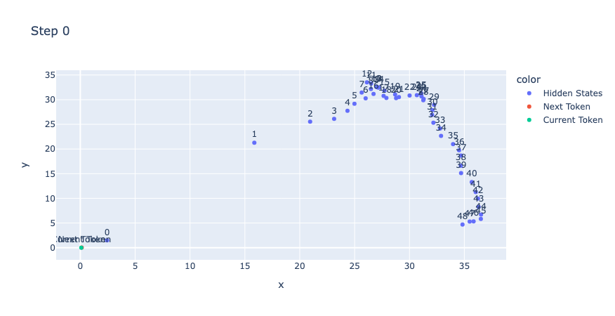
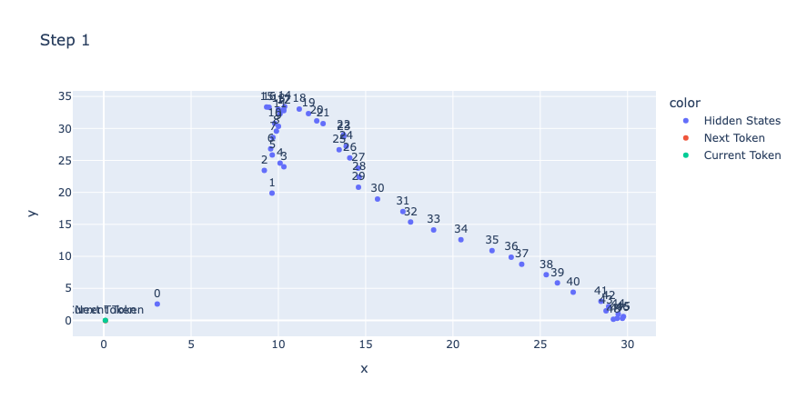
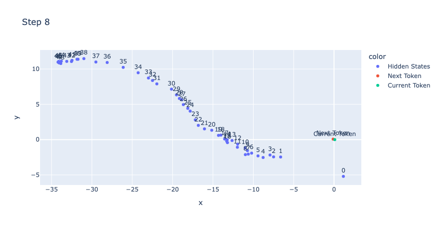
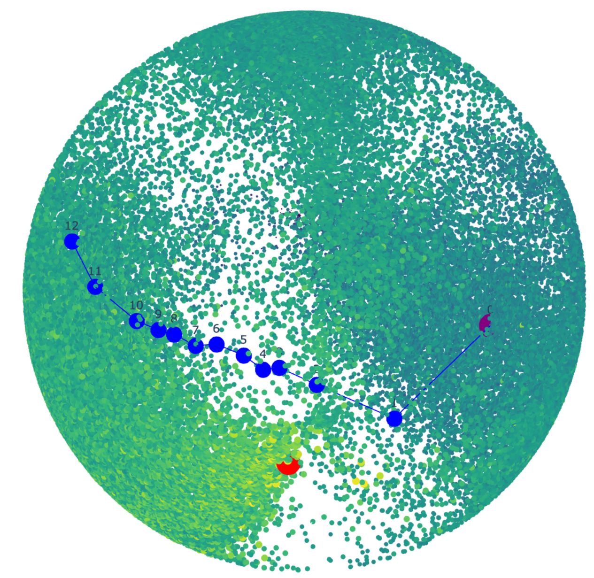
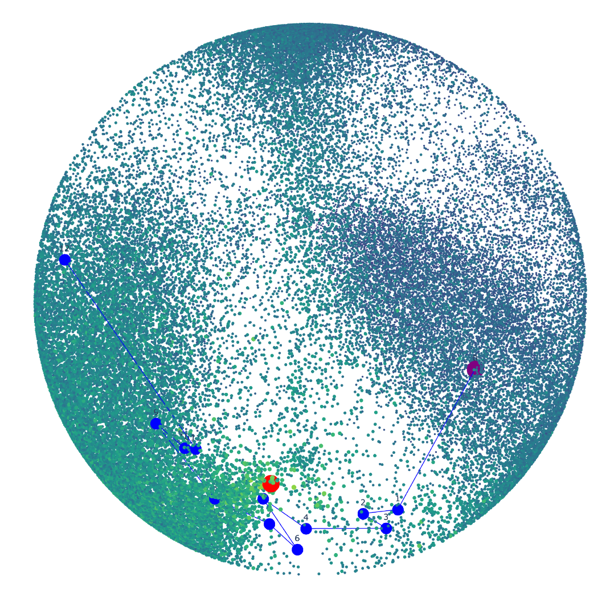
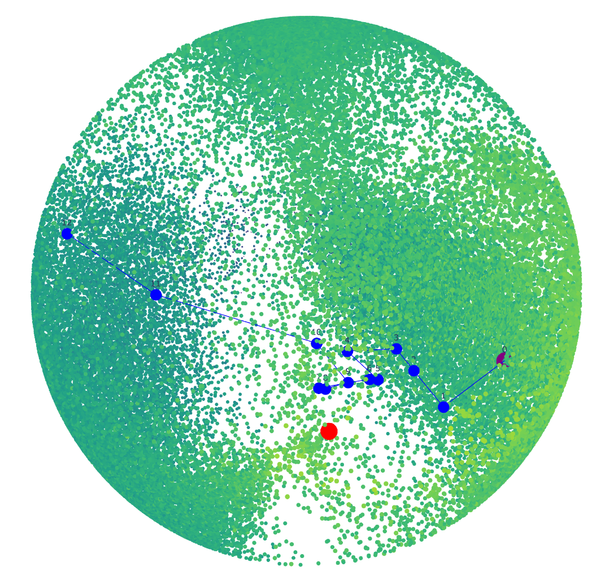
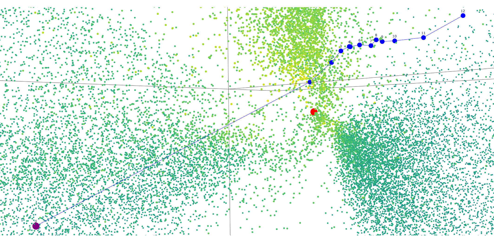

# 19/03/2024

## Test de l'hypothèse last_state(t) = emb(t+1)

Précedemment, j'ai émis quelques hypothèses sur le fonctionnement de GPT-2, et notamment sur le rôle des block d'attention et leur sortie. Mon hypothèse la plus notable était que les blocks d'attention transforment petit à petit l'embeddings reçu en input pour le temps `t` en l'embedding du temps `t+1`. Ce dernier pouvant alors être décoder par le final layer. 

Pour tester cette hypothèse, j'ai donc chercher à visualiser le "chemin" pris par le modèle lors de la prédiction de différents tokens. Ce "chemin" étant composé des différents états obtenus pour un pas de temps (un état est le vecteur résultant d'un block d'attention). 

Si mon hypothèse est la bonne, alors le dernier état obtenu devrait être égale à l'embedding du token prédit, ou à défault, être très proche - avoir une forte similarité cosinus. 

### Chemin parcouru par GPT-2, état après état, dans l'espace des embeddings

#### PCA 2D

Pour essayer de visualiser ce chemin où chaque point est en 768 dimensions, j'ai décidé d'appliquer une PCA en 2 dimensions (sans normalisation), et voici ce que j'obtiens :

*On notera qu'il y a 48 état, car je l'ai fais avec gpt2-xl, qui possède 48 blocks d'attention.

Dans chacun de ces plots, on peut observer que la projection des états est très éloignée de celle des embeddings. Ici, l'ensemble des embeddings se situe dans l'espace [-1:1, -1:1], là où les états ont des valeurs bien plus élevée.

**Hypothèse**  
Ceci pourrait être lié à la norme des états obtenus. Potentiellement, le dernier état est colinéaire à l'embeddings du token predit, où à défaut possède un angle très proche (forte cosine similarity).   

Cette hypothèse paraitrait logique dans le sens où la dernière opération pour prédire le prochain token est un dot product entre le dernier état divisé par sa propre norme (et donc normalisé) et la matrice des embeddings (ce n'est pas équivalent à une cosine similarity, la seule différence étant que l'on ne divise pas par la norme des embeddings).

#### PCA 3D + Projection sur une sphere

Pour tester cette hypothèse visuellement, j'ai tenté d'appliquer d'apprendre une PCA 3D sur la matrice d'embeddings (normalisée sur les dimensions) puis d'afficher chacun des embeddings 3D obtenus dans un espace en 3 dimensions. 

Seulement, étant donné que notre but est d'observer la similarité d'angle entre deux vecteurs, quelque soit leur norme, il parait plus avantageux d'afficher ces vecteurs sur une sphere, et donc de les diviser par leur norme pour qu'ils aient tous une norme de 1. 

Chaque point sur les sphères que l'on peut voir représente un token parmis les 50.000 de GPT2. La couleur associée a chaque point correspond à la probabilité du token associé à être le token prédit. (bleu -> peu probable, jaune -> très probable).

*Avant d'observer les résultats, il est tout de même bon de rappeler que nous sommes passé de 768 dimensions à 3, et que nous n'avons conservé que 4% de l'information lors de cette réduction de dimension. Par conséquent, les angles observés en 3D risquent d'être altérés.*

Vision en dehors de la sphere : 

Vision de l'intérieur :

On peut distinctement voir sur chacune de ces images que le dernier état (numéro 12) est bien différent que le token prédit (le point rouge). 

Ainsi, on peut en conclure que le dernier état de GPT2 n'est pas colinéaire à l'embedding du token prédit.

Ces états ne sont donc probablement pas interpretables dans l'espace des embeddings de GPT2.

#### Normalization sur x ou sur dim

### Similarité entre le dernier état et l'embedding prédit

#### Visualisation 

(vecteur embeddings et spike vecteur predit)

#### Cosine similariy

on cherche un plan orthogonal

### Les états ne sont pas dans l'espace des embeddings

visu plan embeddings et chemin au dessus

### Les états sont décodables en logits grâce à la matrice des embeddings

### Conclusion

Les états internes ne semblent pas être interpretable dans l'espace des embeddings, en revanche, ils peuvent être décoder en logits en les transformant via la matrice des embeddings. 

Le dernier état produit n'est pas `emb(t+1)` mais un vecteur sélectionnant précisemment les bonnes caractéristiques pour pouvoir discriminer `emb(t+1)` par cosine similarity.

## Algorithme génétique pour trouver la topologie de W dans un ESN

### 1ère expérience : réduction de l'espace de recherche

### Choix des fonctions de mutation et de cross-over

### Résultats obtenus

#### Score non stable

problème seed

#### Visualisations des topologies

### Critiques et améliorations possibles

#### W_in ?

#### Valeur continues [-1, 1]

#### SR dépendant de la matrice

rescale ? car on veut tester la topologie, ce serait dommage d'avoir un meilleur résultat car meilleur SR

## Divers

### Data Challenge 2024 (IA PAU)

Vraiment pas beaucoup d'effort de la part de l'entreprise organisatrice.  

Concrètrement on a une base de données avec 50+ tables, aucune doc, aucune explication des relations entre tables ou des signication du vocabulaire utilisé.  

Un peu pareil avec leur plateforme. J'ai passé plusieurs heures, et je n'ai pas réussi à connecter la plateforme à la base de donnée.  

Et, pour couronner le tout, il nous ont donné en clair des associations login/password commentés dans le code, et les logs de connexion à la plateforme de tous les utilisateurs depuis 2013 (adresse IP, date, navigateur web, OS de la machine, etc). 

Aussi, nous avons eu des abandons dans l'équipe (en fait je crois qu'il ne reste que moi maintenant). 

Bref, j'ai signalé le tout et j'ai laissé tomber. Je reviendrai peut-être dessus la semaine prochaine s'ils fournissent de meilleur choses. 

### Comité de Suivi Individuel

### SummerSchool

### PFIA La Rochelle

Il semblerait que notre équipe du hackathon AI4Industry ai été lauréate. Nous sommes convié à La Rochelle pour le PFIA. J'ai cru comprendre en parlant avec Paul que vous y aller déjà pour continuer de prêcher le Reservoir Computing, ça m'intéresse d'y aller ne serait-ce que pour accompagné notre équipe et assister aux conférences. 

Par ailleurs, j'ai cru comprendre que nos frais de déplacement était pris en compte par l'organisation.

## Réponses

