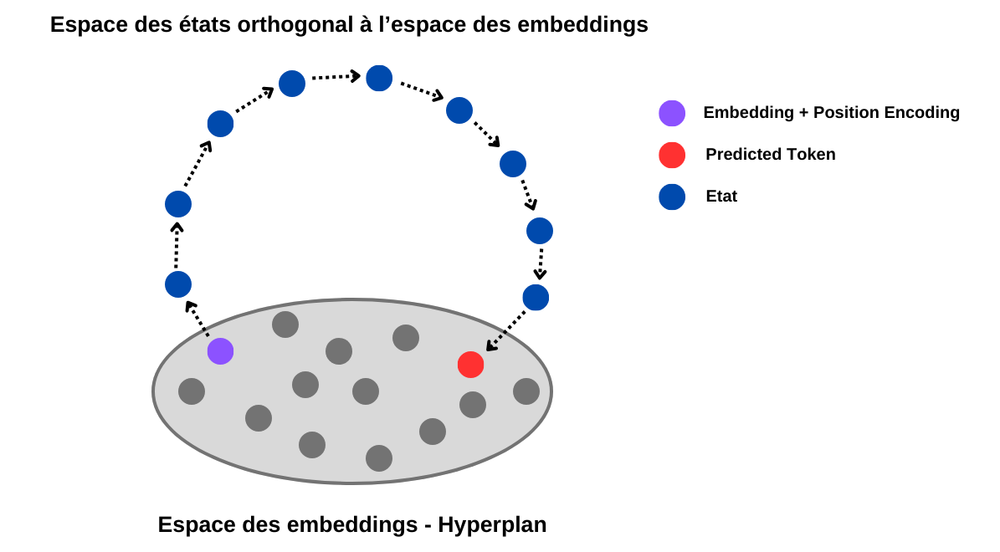
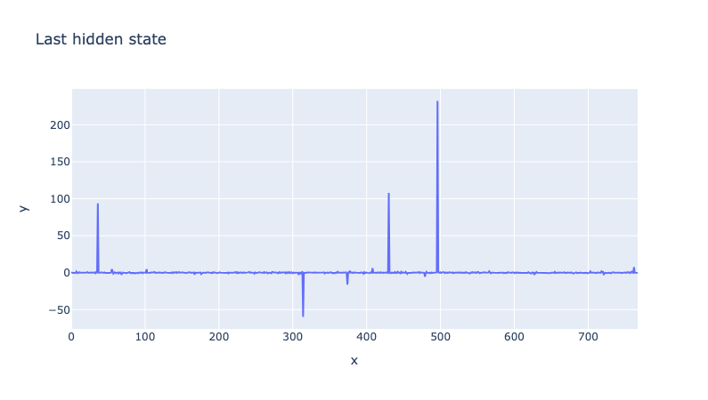
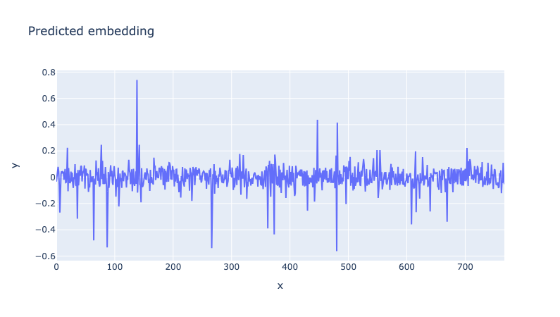

# 19/03/2024

## Test de l'hypothèse last_state(t) = emb(t+1)

Précedemment, j'ai émis quelques hypothèses sur le fonctionnement de GPT-2, et notamment sur le rôle des block d'attention et leur sortie. Mon hypothèse la plus notable était que les blocks d'attention transforment petit à petit l'embeddings reçu en input pour le temps `t` en l'embedding du temps `t+1`. Ce dernier pouvant alors être décoder par le final layer. 

Pour tester cette hypothèse, j'ai donc chercher à visualiser le "chemin" pris par le modèle lors de la prédiction de différents tokens. Ce "chemin" étant composé des différents états obtenus pour un pas de temps (un état est le vecteur résultant d'un block d'attention). 

Si mon hypothèse est la bonne, alors le dernier état obtenu devrait être égale à l'embedding du token prédit, ou à défault, être très proche - avoir une forte similarité cosinus. 

### Chemin parcouru par GPT-2, état après état, dans l'espace des embeddings

#### PCA 2D

Pour essayer de visualiser ce chemin où chaque point est en 768 dimensions, j'ai décidé d'appliquer une PCA en 2 dimensions (sans normalisation), et voici ce que j'obtiens :

*On notera qu'il y a 48 état, car je l'ai fais avec gpt2-xl, qui possède 48 blocks d'attention.


Dans chacun de ces plots, on peut observer que la projection des états est très éloignée de celle des embeddings. Ici, l'ensemble des embeddings se situe dans l'espace [-1:1, -1:1], là où les états ont des valeurs bien plus élevée.

**Hypothèse**  
Ceci pourrait être lié à la norme des états obtenus. Potentiellement, le dernier état est colinéaire à l'embeddings du token predit, où à défaut possède un angle très proche (forte cosine similarity).   

Cette hypothèse paraitrait logique dans le sens où la dernière opération pour prédire le prochain token est un dot product entre le dernier état divisé par sa propre norme (et donc normalisé) et la matrice des embeddings (ce n'est pas équivalent à une cosine similarity, la seule différence étant que l'on ne divise pas par la norme des embeddings).

#### PCA 3D + Projection sur une sphere

Pour tester cette hypothèse visuellement, j'ai tenté d'appliquer une PCA 3D sur la matrice d'embeddings (normalisée sur les dimensions) puis d'afficher chacun des embeddings 3D obtenus dans un espace en 3 dimensions. 

Seulement, étant donné que notre but est d'observer la similarité d'angle entre deux vecteurs, quelque soit leur norme, il parait plus avantageux d'afficher ces vecteurs sur une sphere, et donc de les diviser par leur norme pour qu'ils aient tous une norme de 1. 

Chaque point sur les sphères que l'on peut voir représente un token parmis les 50.000 de GPT2. La couleur associée a chaque point correspond à la probabilité du token associé à être le token prédit (bleu -> peu probable, jaune -> très probable). Le point violet représente le premier état (embeddings + position encoding), les points bleus représentent les états après chaque block d'attention, et le point rouge le token prédit (obtenu en sélectionnant l'argmax du dot product entre l'état 12 et la matrice des embeddings).

*Avant d'observer les résultats, il est tout de même bon de rappeler que nous sommes passé de 768 dimensions à 3, et que nous n'avons conservé que 4% de l'information lors de cette réduction de dimension. Par conséquent, les angles observés en 3D risquent d'être altérés.*

Vision en dehors de la sphere : 


Vision de l'intérieur :


On peut distinctement voir sur chacune de ces images que le dernier état (numéro 12) est bien différent que le token prédit (le point rouge). Or, si ces deux vecteur étaient colinéaire, ils auraient dû le rester même en applicant une PCA. 

Ainsi, on peut en conclure que le dernier état de GPT2 n'est pas colinéaire à l'embedding du token prédit.

### Similarité entre le dernier état et l'embedding prédit

Si nous n'obtenons pas un vecteur colinéaire à la sortie du dernier block d'attention, alors comment GPT2 fait-il pour s'assurer de prédire le bon token à chaque fois ?

Car, si le token est sélectionné en appliquant un dot product entre le dernier état normalisé et la matrice des embeddings, alors cela voudrait tout de même dire que l'embedding du token sélectionné est celui ayant la meilleur cosine similarity avec le dernier état. 

Et nous le montrons d'ailleurs avec ces quelques lignes de code où nous calculons la cosine similarity entre le dernier état et la matrice wte, dans l'espace original puis dans l'espace des embeddings :

```python
def cosine_similarity(x, y):
    return np.dot(x, y) / (np.linalg.norm(x) * np.linalg.norm(y))


# In the original space
print("Original space")
for i in range(10):
    last_state = states[i, -1]
    sim = cosine_similarity(wte, last_state)
    best_sim = np.max(sim)
    pred_sim  = sim[np.argmax(logits[i])]
    same = np.argmax(logits[i]) == np.argmax(sim)
    print(f"Step {i} - Best sim: {best_sim} - Pred sim: {pred_sim} - Equal: {same}")

# in the PCA space
print("\nPCA space")
for i in range(10):
    last_state = normalize(states[i, -1:], axis=0, var=var_wte, mean=mean_wte)
    last_state_pca = pca.transform(last_state)[0]
    sim = cosine_similarity(pca_wte, last_state_pca)
    best_sim = np.max(sim)
    pred_sim  = sim[np.argmax(logits[i])]
    same = np.argmax(logits[i]) == np.argmax(sim)
    print(f"Step {i} - Best sim: {best_sim} - Pred sim: {pred_sim} - Equal: {same}")
```

Et les résultats sont les suivants :

```
Original space
Step 0 - Best sim: -0.000372306298231706 - Pred sim: -0.000372306298231706 - Equal: True
Step 1 - Best sim: -0.0004083050007466227 - Pred sim: -0.0004083050007466227 - Equal: True
Step 2 - Best sim: -0.0003694583137985319 - Pred sim: -0.0003694583137985319 - Equal: True
Step 3 - Best sim: -0.00040663083200342953 - Pred sim: -0.00040663083200342953 - Equal: True
Step 4 - Best sim: -0.0003688412834890187 - Pred sim: -0.0003688412834890187 - Equal: True
Step 5 - Best sim: -0.00041363315540365875 - Pred sim: -0.00041363315540365875 - Equal: True
Step 6 - Best sim: -0.00033197065931744874 - Pred sim: -0.00033197065931744874 - Equal: True
Step 7 - Best sim: -0.0003882184100802988 - Pred sim: -0.0003882184100802988 - Equal: True
Step 8 - Best sim: -0.0003182440996170044 - Pred sim: -0.0003182440996170044 - Equal: True
Step 9 - Best sim: -0.0003583847137633711 - Pred sim: -0.0003583847137633711 - Equal: True

PCA space
Step 0 - Best sim: 0.009889280423521996 - Pred sim: 0.008843865245580673 - Equal: False
Step 1 - Best sim: 0.00941845029592514 - Pred sim: 0.005786040797829628 - Equal: False
Step 2 - Best sim: 0.009943784214556217 - Pred sim: 0.008904648013412952 - Equal: False
Step 3 - Best sim: 0.009350443258881569 - Pred sim: 0.0053653777576982975 - Equal: False
Step 4 - Best sim: 0.009814528748393059 - Pred sim: 0.008769121952354908 - Equal: False
Step 5 - Best sim: 0.00937893521040678 - Pred sim: 0.005145174916833639 - Equal: False
Step 6 - Best sim: 0.01009473204612732 - Pred sim: 0.009072873741388321 - Equal: False
Step 7 - Best sim: 0.009456534869968891 - Pred sim: 0.004559841472655535 - Equal: False
Step 8 - Best sim: 0.010135463438928127 - Pred sim: 0.009123420342803001 - Equal: False
Step 9 - Best sim: 0.009640580043196678 - Pred sim: 0.00449921702966094 - Equal: False
```

Sans surprise, on observe que le token prédit est toujours celui ayant la meilleure cosine similarity avec le dernier état dans l'espace original (768 dim). En revanche, dans l'espace 3D obtenu avec la PCA, l'embedding du token prédit n'est pas celui ayant la meilleur cosine similarity avec le dernier état. Comme expliquer plus haut, la réduction de dimensionnalité peut altérer les angles entre les vecteurs. 

Aussi, observation très curieuse : **la cosine similarity obtenu dans l'espace originale est toujours négative.**  
Comme nous pouvons l'observer dans les résultats ci dessus, la meilleur cosine similarity possède une borne supérieur qui est 0. 

Cette dernière observation m'amène à penser que le dernier état ainsi obtenu est orthogonal à notre espace d'embeddings. Et m'amène à visualiser le schéma suivant pour essayer d'expliquer ce qu'il se passe : 




#### Visualisation du last_state et de l'embedding du token prédit

Mais alors, si le dernier état n'est pas un vecteur colinaire de l'embeddings prédit, mais est orthogonal, comment fait-il pour réussir à discriminer correctement le bon embedding ?

Pour y répondre, nous allons chercher à visualiser un dernier état ainsi que l'embedding qu'il prédit :




Dans ces plots, nous pouvons bien voir à quel point ces deux vecteurs sont différents et mieux comprendre ce qu'il se passe.  
Le dernier état ne cherche pas à reproduire `emb(t+1)`, mais à obtenir un vecteur qui va accentuer très fortement certaines caractèristiques (ou dimensions, parmis les 768) qui vont permettre de discriminer correctement le bon token grâce au dot product avec la matrice des embeddings. 

On peut aussi noter que la somme obtenue par le dot product est toujours négative. Et ceci se montre très bien sur ces plots : les dimensions accentuées dans le dernier état le sont toujours de manière opposé à ces mêmes dimensions de l'embeddings prédit. 

De cette manière, le réseau s'assure d'avoir un résultat toujours négatif. Ce doit être plus simple pour lui de se stabiliser ainsi que d'avoir un coup du positif, un coup du négatif. 

### Les états ne sont pas dans l'espace des embeddings

Toutes ces précédentes explications m'anène à conclure que les états ne sont pas interpretable en tant que tel dans l'espace des embeddings.

### Les états sont décodables en logits grâce à la matrice des embeddings

En revanche, bien qu'on ne puisse pas interpreter ces états dans l'espace des embeddings, nous pouvons appliquer un dot product à chacun de ces états pour obtenir les logits pour chaque token pour chaque état. 

De cette manière, il doit être possible d'utiliser ces logits pour calculer un "centre de gravité", et de visualiser ce centre de gravité se déplacer d'état en état sur la sphère. 

De la même manière, il est possible de voir l'évolution des tokens les plus probables au fur et à mesure des couches. Voici un exemple montrant les 5 tokens les plus probables (de gauche à droite) pour chacune des couches de GPT-2 pour un pas de temps. 

```python
[' three', ' four', 'three', ' challeng', ' livest'] # layer 0 (emb + pe)
['teen', 'teenth', ' hundred', 'fif', ' major'] # layer 1
['teenth', 'teen', ' hundred', 'rd', ' separate']
['teen', ' hundred', 'rd', 'teenth', ' times']
[' hundred', 'teen', 'rd', ' months', ' times']
[' hundred', 'rd', ' major', 'fold', ' brothers']
['fold', 'rd', ' times', '-', ',']
['fold', ',', ' times', '-', ' or']
[',', 'fold', ' times', ' or', '…']
[',', '…', '...', '!', ' …']
[',', '…', '...', ' …', '...']
[',', '…', ' and', '...', ':']
[',', '…', '.', ' and', '...'] # layer 12 (last_state)
```

### Conclusion

Les états internes ne semblent pas être interpretables dans l'espace des embeddings, en revanche, ils peuvent être décoder en logits en les transformant via la matrice des embeddings. 

Le dernier état produit n'est pas `emb(t+1)` mais un vecteur sélectionnant précisemment les bonnes caractéristiques pour pouvoir discriminer `emb(t+1)` par dot product / cosine similarity.


## Algorithme génétique pour trouver la topologie de W dans un ESN

### 1ère expérience : réduction de l'espace de recherche

### Choix des fonctions de mutation et de cross-over

### Résultats obtenus

#### Score non stable

problème seed

#### Visualisations des topologies

### Critiques et améliorations possibles

#### W_in ?

#### Valeur continues [-1, 1]

#### SR dépendant de la matrice

rescale ? car on veut tester la topologie, ce serait dommage d'avoir un meilleur résultat car meilleur SR

## Divers

### Data Challenge 2024 (IA PAU)

Vraiment pas beaucoup d'effort de la part de l'entreprise organisatrice.  

Concrètrement on a une base de données avec 50+ tables, aucune doc, aucune explication des relations entre tables ou des signication du vocabulaire utilisé.  

Un peu pareil avec leur plateforme. J'ai passé plusieurs heures, et je n'ai pas réussi à connecter la plateforme à la base de donnée.  

Et, pour couronner le tout, il nous ont donné en clair des associations login/password commentés dans le code, et les logs de connexion à la plateforme de tous les utilisateurs depuis 2013 (adresse IP, date, navigateur web, OS de la machine, etc). 

Aussi, nous avons eu des abandons dans l'équipe (en fait je crois qu'il ne reste que moi maintenant). 

Bref, j'ai signalé le tout et j'ai laissé tomber. Je reviendrai peut-être dessus la semaine prochaine s'ils fournissent de meilleur choses. 

### Comité de Suivi Individuel

### SummerSchool

### Dataquitaine

CATIE, Thalès, autres

### PFIA La Rochelle

Il semblerait que notre équipe du hackathon AI4Industry ai été lauréate. Nous sommes convié à La Rochelle pour le PFIA. J'ai cru comprendre en parlant avec Paul que vous y aller déjà pour continuer de prêcher le Reservoir Computing, ça m'intéresse d'y aller ne serait-ce que pour accompagné notre équipe et assister aux conférences. 

Par ailleurs, j'ai cru comprendre que nos frais de déplacement était pris en compte par l'organisation.

## Réponses

