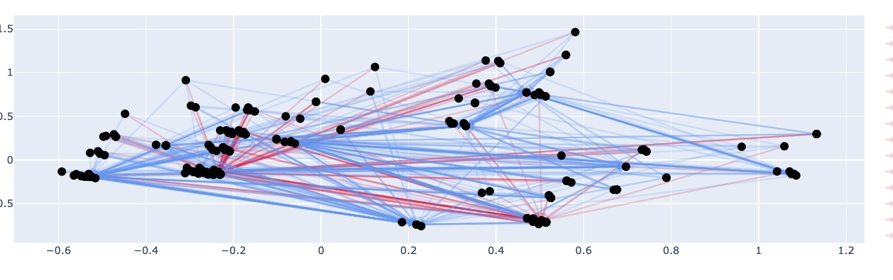

# 08/04/2024

## Algorithme Evolutionnaire pour trouver la topologie d'un Reservoir (ft Naomi)

### Introduction

Naomi m'a proposé il y a quelques semaine de l'aider dans la mise en place d'une expérience : mettre en place un algorithme évolutionnaire pour trouver une topologie pour les matrices `W_in` et `W` d'un ESN. 

Le but de cette expérience est d'essayer de montrer que pour certains problèmes, il existent certaines topologies spécifiques de `W` et `W_in` qui améliorent les résultats face à des matrices random.

La tâche que nous avons choisie est une tâche bien connue de Naomi et où un ESN classique obtient un score d'environ 80%, laissant donc la place à notre algorithme évolutionnaire pour obtenir de meilleur résultats. 

Cette tâche est celle consistant à retrouver le stimuli apportant le plus de récompense dans un scénario où plusieurs stimulis sont montrer dans le désordre et à des endroits différents. 

Nous sommes très rapidement partis sur quelques simples expériences où nous avons défini un individu comme étant un ensemble de features représentée par la matrice `W`, où nous avons limité les valeurs possibles pour les connexions à -1, 0 ou 1 et où nous avons défini les fonctions évolutionnaires comme ceci :

- **Cross-over** : Sélectionne aléatoirement 50% des cellules du parent1, et le complète avec les 50 autres % du parent2 : 


- **Mutate** : Sous une certaine probabilité, sélectionne aléatoirement une ou plusieurs cellule de l'individu, et leur attribue aléatoirement une valeur tout en conservant les probabilités de Sparisté de la matrice. 

```python
def mutate(population):
    new_pop = []
    for i in range(len(population)):
        new = population[i].copy()
        if np.random.rand() < MUTATION_RATE:
            indexes = np.random.choice(N_NEURONS * N_NEURONS, int(N_NEURONS * N_NEURONS * NEURONS_MUTATED_RATE), replace=False)
            for index in indexes:
                if np.random.rand() < START_CONNECTIVITY:
                    new[index // N_NEURONS, index % N_NEURONS] = np.random.uniform(low=-1, high=1, size=1)[0]
                else:
                    new[index // N_NEURONS, index % N_NEURONS] = 0
        new_pop.append(new)
    return np.array(new_pop)
```

### Résultats première expérience

Nous avons lancé de nombreux entrainements avec différents paramètres de départ et d'évolution, cependant nous n'avons pas obtenu de résultats significatifs. Par ailleurs, il semblairait que l'algorithme convergeait très rapidement vers des optimums local et y restait bloqué. 

Aussi, nous avons démarré nos générations à partir d'individu aléatoire possèdant 50 à 500 neurones fixes environs. Ce qui, nous devons l'admettre, n'est pas optimale. Il faudrait commencer avec 1 neurone si nous souhaitons que l'ensemble des connexions de la topologies soit dû à l'évolution. 

Nous avons toute de même tenter quelques visualisations. Etant donné que l'on peut définir un neurone comme étant ses connexions sortantes (ou ses connexions entrantes), et que dans le plus grand des cas, nous avons 500 neurones (et donc chaque neurone est un vecteur de 500 dimensions), nous avons appliqué une PCA sur ces dimensions pour essayer de visualiser au mieux des "groupes de neurones" ayant des caractèristiques (des connexions) très similaires.

Voici des formations que l'on a pu obtenir avec cette visualisation (les connexions rouge sont positives, celles en bleu sont négatives) :





### Utilisation de NEAT

Suite à nos résultats, Naomi a approfondie les recherches sur les solutions existantes pour trouver une topologie pour un Reservoir via algorithme génétique, et elle a trouvé plusieurs travaux, dont celui-ci : *"A NEAT Way for Evolving Echo State Networks" par Kyriakos C. Chatzidimitriou et Pericles A. Mitkas*.

Dans cet article, il introduise notamment la notion d'espèce dans un algorithme génétique pour mieux permettre aux individus de chaque génération de faire bénéficier ses descendants de ses mutations (éviter ainsi une convergence trop rapide dans des minimum locaux, et permettre un meilleur parcours de l'espace de solution).

Une implémentation open-source de cet algorithme NEAT existe déjà sur Github : https://github.com/noio/peas. Nous avons commencer les tests avec cet algorithme, où nous cherchons cette fois-ci à commencer avec seulement 1 neurone, et où nous cherchons à la fois la matrice `W`, mais aussi la matrice `W_in`. 

Nous n'avons pas encore pu aller très loin dans les générations, mais ça ne saurait tarder. Nous avons pour l'instant constaté une nette amélioration des résultats entre les premières générations et les dernières, seulement cela est normal car les premières générations possèdent très très peu de neurone. 

La suite prochainement...

## Distiled Reservoir Transformer (suite)

### Chemin des centroïds de logits obtenu layer après layer (GPT-2)

Précedemment, je disais ceci : 

>**Les états sont décodables en logits grâce à la matrice des embeddings**
>
>En revanche, bien qu’on ne puisse pas interpreter ces états dans l’espace des embeddings, nous pouvons appliquer un dot product à chacun de ces états pour obtenir les logits pour chaque token pour chaque état.
>
>De cette manière, il doit être possible d’utiliser ces logits pour calculer un “centre de gravité”, et de visualiser ce centre de gravité se déplacer d’état en état sur la sphère.

J'ai donc tenter l'expérience :  je fais générer à GPT2 10 tokens pour compléter une phrase. Pour chacun de ces tokens, je conserve les `hidden_states` pour chacun des 12 layers de GPT-2. Puis, je les converti en `logits` en les multipliant avec la matrice des embeddings transposée. J'obtiens alors les `probabilités` pour chaque token d'êre prédit en appliquant un softmax. Et finalement, je calcul le centroid d'un `hidden_states` dans l'espace des embeddings en sommant l'ensemble des vecteurs d'embeddings pondéré par sa probabilité d'être prédit. 

Ceci me donne alors un point par layer et par token, que je peux visualiser sur la sphère des embeddings. Et, comme prévu, le chemin n'est pas parfait à cause de la réduction de dimensionnalité (on passe de 768 dimension à 3, en conservant moins de 5% de l'information), mais on peut très souvent le visualiser comme commençant à la position du token courant, puis se déplaçant jusqu'à prochain token (celui prédit). 

Voici quelques images où ceci se voit bien :  
> **point jaune** : *token courant*  
> **point rouge** : *token prédit*  
> **point violet** : *token courant + pos encoding*  
> **point bleu** : *centroid layer i*  


### Distillation de la couche d'attention seulement (avant FF dans le bloc d'attention) (BERT)

Lorsque l'on regarde un bloc d'attention, on observe qu'il se découpe en deux parties :
- Une couche d'attention (calcul du softmax(QK.T/sqrt(d).V . O))
- Un feed-forward composé de deux couches 

Selon certain papier, ce feed-forward a pour but d'enrichir notre représentation en lui sommant une combinaison de "patterns" qu'il aurait mémorisé lors de l'entrainement. L'une de mes hypothèses était alors que ce feed forward contenant beaucoup d'information, il allait être compliqué de le distiller au sein d'un Reservoir. 

J'ai donc souhaité tester si nous obtenions de meilleurs résultats en ne distallant que la couche d'attention dans un réservoir, et non l'ensemble du bloc d'attention. A ma grande surprise, nous obtenons des résultats équivalents. Il ne semblerait pas y avoir de gain particulier à apprendre seulement la couche d'attention. Il semblerait donc que la difficulté de distiller un Transformer dans un Reservoir réside dans le fait de distiller le mécanisme d'attention, ce qui est très logique, car c'est bien là que nous cherchons à passer d'une opération en O(N^2) à une opération en O(1).  

Je précise que ce test a été mené sur BERT (un encodeur), peut-être obtiendrons nous des résultats différents avec GPT2. 

### ReservoirBert (12 layer : 12 ESN)

Etant donné que j'obtenais de bons résultats lors de la distillation d'un layer de BERT, je suis parti dans l'optique de distiller chacun des layer bout à bout, et d'essayer de recréer un modèle BERT entier mais avec des Reservoir, pour finalement le tester sur le BenchMark GLUE et pouvoir le comparer à BERT classique. 

Je n'ai pas encore eu le temps de faire les tests avec GLUE, cependant j'ai pu tester d'entrainer un modèle de 12 Reservoir avec différentes taille pour N. Ainsi, pour 1000 sample (~250,000 tokens), l'entrainement prends environ 1h30 pour des Reservoir de 500 neurones, et près de 5h pour 1000 neurones. 

Pour 1000 neurones, voici les résultats que j'obtiens : 

```
MSE layer 0: 0.13462846439326098
MSE layer 1: 0.2363140987098282
MSE layer 2: 0.26718387749517697
MSE layer 3: 0.2953115402061263
MSE layer 4: 0.32278212710672677
MSE layer 5: 0.35198918433620435
MSE layer 6: 0.3627166291160212
MSE layer 7: 0.35284502293135184
MSE layer 8: 0.3772252756770791
MSE layer 9: 0.3862503352772423
MSE layer 10: 0.38871074805211114
MSE layer 11: 0.18681667131176855
```

Ainsi, j'ai bon espoir d'obtenir un score de MSE inférieur à 0.10, voire proche de 0.05 pour 10.000 neurones par Reservoir. Cela dit, je vais devoir lancer cet entrainement sur Plafrim.   
*Selon mes précédentes expériences, une MSE de 0.05 semble très bonne et intéressante.*

> A titre indicatif, 12 Reservoirs de 10.000 neurones donnerait un modèle d'environ 9M de paramètre, là où BERT_base en possède environ 110M. 

> /!\ Je dois faire quelques vérifications avant de considérer ces résultats comme valides.


## Réponses

> Est-ce que tu as essayé aussi avec BERT (car GPT-2 a beaucoup de couches et pas sûr qu’elles servent toutes vraiment à qqch comme on disait), ça permettra de voir ce qui est commun entre les deux modèles et ce qui est particulier (et donc peut être juste à biais du modèle).

Non je n'ai pas encore faire cette expérience avec BERT.

> As-tu testé d’autre réduction de dimension que l’ACP ? ça serait intéressant d’utiliser UMAP qui permet de prendre en compte pas seulement les 3 composantes avec le plus de variance, et qui est devenu un point de référence récemment (donc des reviewers risquent de le demandé dans tous les cas).

Non je n'ai pas essayer, mais en effet cela a du sens. 

> Est-ce que l’on est sur que cela ne vas pas trop influencer les représentation de tout normaliser ?

Lorsque GPT-2 prédit le dernier token, il fait l'opération suivante : 

```
logits = last_hidden_state * matrix_embeddings.T
```

Or, le `last_hidden_state` est un vecteur qui est passé par un `LayerNorm` juste avant, et la matrice des embeddings est une matrice de poids (censée être régulariser lors de l'entrainement).  
Ainsi, lorsque l'on décompose le calcul, on effectue un dot product entre le `last_hidden_state` normalisé (`A/|A|`) et chaque vecteur de la matrice d'embedding régularisée (`B, B ∈ [-1, 1]`). Ce n'est pas exactement une cosine similarity (`A.B / |A|*|B|`), mais c'est très très proche.   

> As-tu fait des tests pour voir quelles étaient les trajectoires à l’intérieur de la “boule” (tout le volume dans la sphère) ? Peut-être que le trajet est moins “écrasé” sur le périmètre (i.e. la sphère) dans ce cas.

Je ne comprends pas ces questions.

> Je ne suis pas sur de comprendre à quoi correspond la “vue de l’intérieur”

La caméra est juste placée en (0, 0, 0). Au centre de la sphère. 

> Est-ce que tu as cherché des papiers qui faisaient des représentation sur de sphères, et d’autres papiers sur les représentations de GPT-2 ou d’autres transformers ? cela pourrait donner des pistes.

J'ai cherché en effet, et je n'ai trouvé qu'un seul travaux qui cherche à faire des embeddings sur des espaces riemanniens (des sphères en réalité). 

> Même question sur les papiers concernant ces “derniers états” un peu spéciaux, etc.

Il y a quelques papiers qui essayent de comprendre comment interpreter ces états, mais il y a très peu de visualisation, ou pas du tout. 

## Nouvelle idée de modèle : Anarchist Reservoir Units

## Papiers

- [Cosine Normalization: Using Cosine Similarity Instead of Dot Product in Neural Networks (2017)](https://arxiv.org/pdf/1702.05870.pdf)

The paper introduces a novel technique called cosine normalization, which utilizes cosine similarity or Pearson correlation coefficient instead of dot product in neural networks. This approach effectively reduces the variance of neurons, improves model robustness, and accelerates training, as demonstrated through experiments on various network types and datasets.

- [Analyzing Transformers in Embedding Space (2023)](https://arxiv.org/pdf/2209.02535.pdf)

The paper presents a novel approach to interpreting Transformer-based models by projecting their parameters into the embedding space, demonstrating that this method allows for the interpretation of both pretrained and fine-tuned models. The findings suggest that understanding Transformers in the embedding space can abstract away model specifics and enable various applications, such as aligning parameters of different models and constructing classifiers without additional training.

- [Jump to Conclusions: Short-Cutting Transformers With Linear Transformations (2023)](https://arxiv.org/pdf/2303.09435.pdf)

The article "Jump to Conclusions Short-Cutting Transformers With Linear Transformations" explores the use of linear transformations to accelerate the inference of transform models. The authors find that using non-contextual linear computations in transformer inference leads to a slight deterioration in predictions, opening up new avenues of research to improve model efficiency.

- [A Reservoir Computing Approach to Word Sense Disambiguation (2020)](https://sci-hub.3800808.com/10.1007/s12559-020-09758-w)

This paper presents a reservoir computing approach, specifically the deep bi-directional echo state network (DBiESN), for word sense disambiguation (WSD) in natural language processing. The authors propose a novel method for exploiting reservoirs' steady states and demonstrate that the DBiESN model offers a good alternative to other tested models, achieving similar accuracy in WSD tasks with fewer trainable parameters.

- [A NEAT Way for Evolving Echo State Networks (2010)](https://www.researchgate.net/publication/220838636_A_NEAT_way_for_evolving_Echo_State_Networks)

This paper presents a method for evolving Echo State Networks (ESNs) by combining evolution and learning. The goal is to automatically discover function approximators that can perform well in complex real-world tasks. The paper provides a brief overview of ESNs, describes the methodology used, presents the experiments and outcomes, and concludes with a discussion on future improvements.

- [Behaviors of Reservoir Computing Models for Textual Documents Classification (2019)](https://sci-hub.3800808.com/10.1109/ijcnn.2019.8852304)

The article "Jump to Conclusions Short-Cutting Transformers With Linear Transformations" explores the use of linear transformations to accelerate the inference of transform models. The authors find that using non-contextual linear computations in transformer inference leads to a slight deterioration in predictions, opening up new avenues of research to improve model efficiency.

- [ViR: the Vision Reservoir (2021)](https://arxiv.org/pdf/2112.13545.pdf)

This paper introduces ViR, a novel model for image classification that is more efficient than the Vision Transformer (ViT). ViR achieves superior performance on small-scale benchmarks with fewer parameters and a smaller memory footprint compared to ViT.