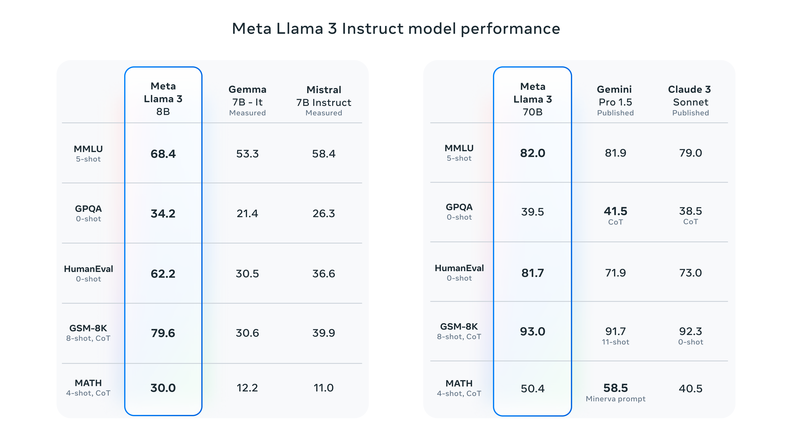

# 22/04/2024

## Reservoir Computing with Forward Anarchist Units

J'ai en tête depuis plusieurs semaines une idée d'architecture de réseaux de neurone récurrent, très inspiré du Reservoir Computing dans sa structure, mais qui remplacerait les Units habituelles par des Units plus spécialisées (attention, mémoire, autre ?), capables d'éxécuter plus de calculs en leur sein, et surtout capable d'apprendre sur les données. 

L'idée étant de conserver cet aspect de Readout qui apprends sur l'activité sur Reservoir, et de ne pas utiliser de backpropagation pour propager l'erreur, mais que chacune des unités du Reservoirs apprennent indépendemment les unes des autres, et indépandemment de la sortie du Readout, chacune devant être responsable d'elle même, et n'utiliser que ses données d'entrée, ainsi que des états internes qu'elle peut avoir calculé au temps précédent (`t-1`). 

Pour ce faire, chaque unité peut essayer de prédire un état courant (à l'instant `t`), et un état futur (à l'instant `t+1`) via des poids à apprendre. Puis, à chaque pas de temps, elle peut mesurer son erreur de prédiction entre l'état courant et l'état futur du pas précédent et modifier ses poids pour améliorer ses prédictions.
 
Plusieurs achitecture peuvent être pensé pour réaliser une telle tâche. Et, nous pouvons aussi faire le rapprochement avec le **Predictive Coding**.

Cela dit, comme nous le disions au début de l'énoncé, l'un des buts est de créer différentes cellules ayant différentes fonction (attention, mémoire, autre ?). L'une des manières de faire ceci pourrait être d'utiliser des règles d'apprentissage différentes selon le besoin. Ainsi, si une approche similaire au **Predictive Coding** peut paraître intéressantes pour des units d'attention, une approche similaire au **Forward-Forward** de Hinton peut l'être pour des units de mémoire. 

Pour illustrer ceci, voici un schéma d'une architecture imaginée pour une unité d'attention.  
*(Ce schéma n'est pas définitif, loin de là, mais il essai de présenter l'idée de la manière la plus simple possible. Les fonctions d'activation ne sont pas représentée car je suis encore en réflexion dessus.)*


## Evo-topo (ft Naomi)

Nous n'avons pas beaucoup avancé ces dernières semaines, cependant nous avons eu quelques résultats assez prometteurs avec NEAT. 

Nous avons notamment observer qu'au bout de plusieurs dizaines de générations nous réussissions à obtenir des modèles obtenant plus de 60% de réussite au problème en utilisant seulement 9 units.  
Pour rappel, sans cette méthode, les meilleurs résultats que Naomi a obtenu jusqu'à présent sont de 80% pour 500 neurones, alors que l'aléatoire donnerait 25%.

Nous observons aussi que les meilleurs individus sont obtenus losque nous commençons avec des individus possèdant 1 seul neurone. Si nous commençons avec plus, l'algo génétique n'est plus a l'origine de chacun de ces neurones, et par conséquent certains d'entre eux ne sont vraiment pas optimaux et se maintiennent au fil des générations.

## ReservoirBERT

### Parallèlisation des calculs

Avec l'aide de Paul, j'ai pu modifier mon script d'entrainement pour utiliser les noeuds `ESN` au lieu de composer moi même mon architecture via les noeuds `Input`, `Reservoir` et `Ridge`. Ces noeuds `ESN` permettent de parallèliser les calculs sur l'ensemble des CPUs de l'ordinateur grâce au paramètre `workers=-1`. 

De plus, nous avons changé la méthode d'entrainement. Au lieu d'entrainer mes ESNs en online via RLS, nous faisons un entrainement offline, ESN après ESN, permettant un gain de temps **considérable**, tel que :

1. **12 x 1.000 units, 1.000 samples :**  l’entrainement prends environ 5 minutes, au lieu de 300 minutes précédemment. 

2. **12 x 10.000 units, 1.000 samples :** l’entrainement prends environ 80 minutes, au lieu de 20.000 minutes (estimées) précédemment.

*(Résultats obtenus son mon ordinateur.)*

On peut donc envisager des entrainements bien plus costauds (plus de données, plus de neurones). J'ai donc lancé via plafrim un entrainement sur 10.000 textes (soit environ 2.5M de tokens) et 12 ESNs de 10.000 units. 

### Meilleur standardisation pour de meilleur résultats

En parralèle de ces optimisations, j'ai pu améliorer (corriger ?) ma standardisation pour ce problème. Ramenant toutes mes valeurs entre `[-1, 1]`, au lieu de l'intervalle `[-3, 3]`. Cet intervalle étant bien plus intéressant pour l'entrainement d'ESN.

Mes résultats se sont ainsi améliorer. Et prenne aussi bien plus de sens. 

Voici ce que l'on obtiens pour 12 ESNs de 10.000 neurones s'entrainant sur 1.000 textes : 

```
MSE layer 0: 0.010947482806708543
MSE layer 1: 0.020600225123221582
MSE layer 2: 0.030639898507378624
MSE layer 3: 0.03744137388033629
MSE layer 4: 0.04147068722629457
MSE layer 5: 0.04657889986539417
MSE layer 6: 0.049359773494836924
MSE layer 7: 0.05179795107840946
MSE layer 8: 0.057281950497889096
MSE layer 9: 0.058559377366580574
MSE layer 10: 0.056101669395587056
MSE layer 11: 0.056837898071326845
```

*(Je me sens un peu naze de ne pas avoir vu / fait ça avant, mais mieux vaut tard que jamais...)*

L'une de mes prochaines étapes sera de relancer une recherche d'hyper-paramètres, car ceux utilisés actuellement sont toujours étranges, et ne doivent pas être optimaux pour la standardisation que j'utilise. Pour rappel, les voici :

```
units = 10000
leak_rate = 0.985
spectral_radius = 2.8
input_scaling = 5.0
connectivity = 0.003
input_connectivity = 0.05
ridge = 0.276
seed = 42
```

## Deploiment LLM Inria (tests)

Nous avons continuer nos tests de perfomance de déploiment de LLM sur des A100s de Plafrim. Nous avons continuer avec Mixtral 8x7b, mais aussi avec Mixtral 8x22b - et notamment sa version finetune par Microsoft : WizardLM-2-8x22b - rendu publique il y a une dizaine de jour seulement. 

### Pour Mixtral 8x7B


### Pour Mixtral 8x22B


En fin de semaine dernière, Meta a rendu publique de nouveaux modèles : Llama 3 (8b et 70b), apportant là aussi une révolution. On peut voir entre autre que la version 8B semble se positionner au dessus de Mixtral 8x7b. 

Et, en début de cette semaine, Microsoft a annoncé Phi-3, 3 modèles de 3.8B, 7B et 13B. Ces modèles ne sont pas encore open-weights (mais devrait l'être), mais surpassent tous Llama 3 8B selon Microsoft. Wait & See... 

Bref, les modèles open-weights et les petits modèles semblent avoir un bel avenir devant eux. 



## Comité de Suivi Individuel

Nous avons composé notre Comité de Suivi Individuel. Ses membres sont les suivants :

- Nathanaël Fijalkow 
- Pierre-Yves Oudeyer

Notre première réunion est planifiée pour le 25 juin à 14h00. 

## Papers

- [Neural Turing Machine (2014)](https://arxiv.org/pdf/1410.5401.pdf)

The Neural Turing Machine (NTM) is a neural network architecture that includes an external memory component, allowing it to store and manipulate information in a way that is analogous to a traditional computer's memory. The NTM uses a differentiable attention mechanism to read from and write to this memory, allowing it to learn to perform complex tasks that require reasoning and memory. The NTM is trained using gradient descent, making it possible to learn its parameters from data.

- [The Forward-Forward Algorithm: Some Preliminary Investigations (2022)](https://arxiv.org/pdf/2212.13345.pdf)

The Forward-Forward Algorithm (FF) is a new learning procedure for neural networks that aims to replace the forward and backward passes of backpropagation with two forward passes, one with positive data and the other with negative data. Each layer in the network has its own objective function, which is to have high goodness for positive data and low goodness for negative data, and the sum of the squared activities in a layer can be used as the goodness. The FF algorithm is different from backpropagation in that it does not require the computation of gradients or the storage of intermediate values, and it can be used in situations where the precise details of the forward computation are unknown.


- [Predictive Coding (2011)](https://sci-hub.3800808.com/https://doi.org/10.1002/wcs.142)

Predictive coding is a framework that explains how the nervous system reduces redundancy and efficiently codes sensory information by transmitting only the unpredicted portions of an incoming signal. This framework provides a functional explanation for various neural responses and aspects of brain organization, such as center-surround response properties and biphasic temporal antagonism in the retina and lateral geniculate nucleus, as well as oriented receptive fields and contextual effects in the higher visual system.

- [Predictive Coding A Theoritical and Experimental Review (2022)](https://arxiv.org/pdf/2107.12979.pdf)

Predictive coding is a theory of brain function that suggests the brain's primary objective is to minimize prediction errors, which are the differences between predicted and actual sensory input. The theory proposes that the brain achieves this through a hierarchical network of layers, each making predictions about the activity of the layer below and passing prediction errors upwards to update higher-level predictions.

- [Representation Learning with Contrastive Predictive Coding (2018)](https://arxiv.org/pdf/1807.03748.pdf)

Contrastive Predictive Coding (CPC) is a method for unsupervised learning that combines autoregressive modeling and noise-contrastive estimation to learn abstract representations of high-dimensional data. CPC has been shown to achieve strong or state-of-the-art performance in a variety of domains, including audio, images, natural language, and reinforcement learning, when used as stand-alone features or in conjunction with the main loss.

- [AmadeusGPT a natural language interface for interactive animal behavioral analysis (2023)](https://arxiv.org/pdf/2307.04858.pdf)

AmadeusGPT is a natural language interface that turns natural language descriptions of animal behaviors into machine-executable code, using a novel dual-memory mechanism to overcome the context window limitation of large language models. It allows users to interactively refine results and add new behavioral modules as needed, without requiring any coding skills, and has shown excellent performance on the MABe 2022 behavior challenge tasks.