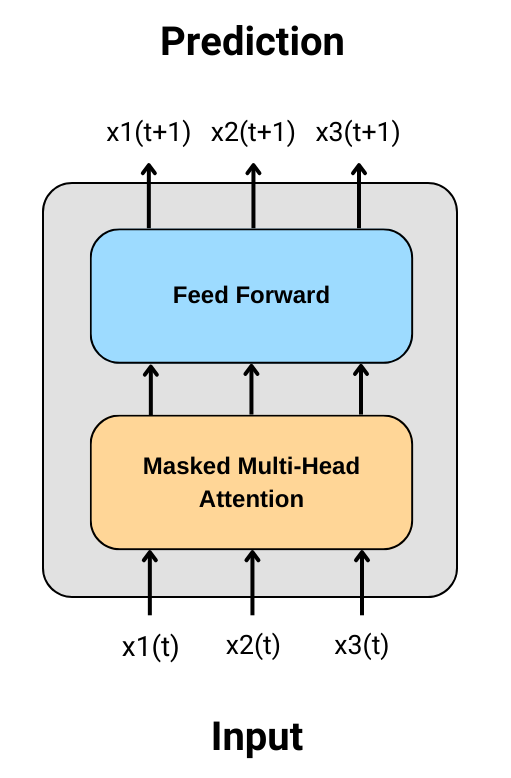
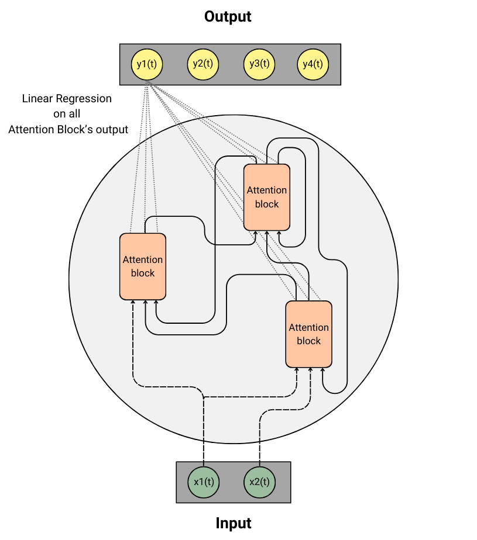

# 07/05/2024

## Foward Anarchist Units

J'ai donc cherché à implémenter des unités comme décrite dans le schéma ci-dessus. Etant donné que chacune de ces matrices devaient apprendre "indépendamment" de l'autre, j'ai choisi comme algorithme d'apprentissage deux simples regressions linéaires. Puis j'ai testé en créant des fonctions non linéaires "simples" (sinus, cosinus, quadratique) et d'autres fonctions plus complexes générées aléatoirement. 

Et la conclusion est sans appel, ***nous ne convergeons pas systématiquement.***  

Et, en général, lorsque nous convergeons, une seule dimension est prédite plus ou moins correctement, les autres non. 

On peut noter les conclusions suivantes :
- L'entrainement indépendant et simultannée de plusieurs matrices qui agissent entre elles n'est pas simple. Il complique très fortement la convergence car chaque matrice apprends à recevoir des entrées qui ne sont plus correcte à l'étape d'optimisation suivante. 
- La somme que l'on calcule pour obtenir une seule sortie par unité n'est pas très performante ni maline car on ne l'entraine jamais : nos matrices ne reçoivent pas de retour des unités suivantes pour indiquer si la somme produite a de la valeur ou non.
- L'architecture est "trop compliqué" et hasardeuse car elle ne part pas de bases que l'on connait très bien. Il serait plus malin de partir d'architecture déjà connue et matrisée. 

## Attention Unit Reservoir

### Attention block from Attention is All you Need

Suite à nos discussions et aux précédentes conclusions, j'ai modifié l'architecture que je mentionne plus haut. Au lieu de créer mes propres units, je prends comme units des blocks d'attention tels que définis dans le papier "Attention is all you need" (voir schéma plus bas). Seulement, j'y apporte trois petites spécificités : 
1. Ces blocs d'attention doivent travailler à un niveau très local, par conséquent j'envisage des inputs de très petite dimension (de l'ordre de 3-5). 
2. Chaque bloc d'attention doit apprendre via backpropagation à prédire ses inputs au temps `t+1`. La backpropagation se limite au bloc d'attention : les gradients se calcul au sein d'un block et ne sont pas altérés par les autres blocs d'attention.
3. Chaque unité contient une mémoire qui lui est propre est qui correspond à ses `M` dernières entrées. `M` étant un hyperparamètre du modèle (plus M est petit, plus la matrice d'attention calculées - qui grossit selon `M^2` - sera petite). 



### Un Reservoir d'Unité d'Attention

Si l'on décide de relié aléatoirement ces différentes unités, on obtiens quelque chose qui ressemble à ça :



On peut noter les choses suivantes :
- Une unité calcule donc autant de sortie qu'elle prend d'entrée (car elles prédit ses entrées à `t+1`). Ceci nous évite de faire une somme non optimisée à la sortie de notre cellule.
- Si chaque unité possède autant de sortie que d'entrée, et qu'on doit en plus prendre en compte des connexions extérieurs (les inputs et feedback du graphe), alors nécessairement toutes les sorties ne pourront être connecté à une autre unité (comme visible sur le schéma). Cela dit, toutes les sorties sont utilisées pour la regression linéaire.  
- A l'instar de ce que l'on a rencontré précédemment, l'apprentissage simultanée de toutes les unités risque d'être compliqué et de ne pas converger car les entrées d'une unité dépendent des sorties d'autres unités. Par conséquent, si toutes les unités modifient leur poids simultanément, chaque unité apprends à reconnaitre des entrées qui ne seront plus valide au pas d'optimisation suivant. **Une solution peut être d'entrainer une seule unité à chaque batch, en sélectionnant celle ayant la plus grosse loss.** Voire, de sélectionner plusieurs unités qui sont suffisement éloignée les unes des autres : c'est à dire non connectées, ou connectées mais à une certaines distance minimum. 
- Actuellement, il n'existe qu'un seul type d'unité : les blocs d'attention. Cela dit, peut être qu'à l'avenir il pourrait être bon de décomposer nos blocs d'attention en deux différents blocs : un bloc mémoire (Feed Forward) et un bloc d'attention (Masked Multi-Head Attention).

Ainsi pour entrainer notre modèle, nous pouvons utiliser l'algo suivant :
```
1. Run un batch
2. Calculer la loss du batch pour chaque unité
3. Selectionner l'unité ayant la plus grande loss, et y appliquer la descente de gradient. 
4. Nettoyer le gradient des autres unités
5. Retour étape 1.
```

### Matrice de passage

Le Reservoir doit donc enregistrer un état à chaque pas de temps. Cet état correspond à l'ensemble des sorties de ses unités. Ainsi, on peut créer la matrice suivante et la remplir au fur et à mesure pour actualité son état.
```
__ | inputs | unit_1 | unit_2 | unit_3 | outputs
d1 |     x1 |   s1,1 |   s2,1 |   s3,1 |      y1
d2 |     x2 |   s1,2 |   s2,2 |   s3,2 |      y2
d3 |      0 |   s1,3 |   s2,3 |   s3,3 |      y3
d4 |      0 |      0 |      0 |      0 |      y4
```

Et, pour rediriger les sorties des unités vers les autres unités, on peut utiliser une matrice de connection que l'on initialise aléatoirement lors de la création du Reservoir. 
```
| ---- | unit_1 | unit_2 | unit_3 |      # outputs -> inputs
| x1   |      1 |      1 |      0 |      # x1 -> u1, u2
| x2   |      0 |      1 |      0 |      # x2 -> u2
| s1,1 |      0 |      0 |      0 |      # s1,1 -> None
| s1,2 |      0 |      0 |      1 |      # s1,2 -> u3
| s1,3 |      0 |      0 |      0 |      # s1,3 -> None
| s2,1 |      1 |      0 |      0 |      # s2,1 -> u1
| s2,2 |      0 |      0 |      1 |      # s2,2 -> u3
| s2,3 |      0 |      0 |      0 |      # s2,3 -> None
| s3,1 |      1 |      0 |      0 |      # s3,1 -> u1
| s3,2 |      0 |      1 |      0 |      # s3,2 -> u2
| s3,3 |      0 |      0 |      1 |      # s3,3 -> u3
|   y1 |      0 |      0 |      0 |      # y1 -> None # Feedback
|   y2 |      0 |      0 |      0 |      # y2 -> None # Feedback
|   y3 |      0 |      0 |      0 |      # y3 -> None # Feedback
|   y4 |      0 |      0 |      0 |      # y4 -> None # Feedback
```

La seule contrainte de cette matrice étant que la somme de chaque colonne doit être égale au nombre d'entrée de l'unité correspondante (dans notre example, chaque unité a donc 3 entrées).

Il est alors possible de calculer les entrées de chaque unité au temps suivant en utilisant la matrice de connection et la matrice d'état. Pour cela, il faut vectoriser la matrice d'état (sans prendre en compte les valeurs à zéro dans l'exemple ci-dessus) de manière à obtenir un vecteur de la forme :
```
[x1, x2, s1.1, s1.2, s1.3, s2.1, s2.2, s2.3, s3.1, s3.2, s3.3, y1, y2, y3, y4]
```

Puis, on peut multiplier le transposé de ce vecteur par la matrice de connection.

*Note : Selon les dimensions d'inputs, d'outputs et les dimensions des unités l'utilisation de la matrice d'état est plus ou moins pertinente. Un simple vecteur pourrait être plus adapté.*

### RL : Unité en Symbiose

Nous parlions de Reinforcement Learning pour entrainer nos blocs d'attention. Une solution que j'ai imaginé est d'essayer d'inciter les unités à fonctionner en symbiose : c'est à dire à fournir des sorties qui sont utiles pour les autres unités.  

Pour cela, on peut imaginer que chaque unité utilise comme récompense le poids associé à ses sorties par les autres unités. On pourrait le voir comme un retour d'énergie dont une unité aurait besoin pour fonctionner. Si une unité ne fournit pas de sortie utile, alors elle ne reçoit pas d'énergie en retour et ne peut pas fonctionner.  

Or, une unité ne peut pas modifier les poids des autres unités, elle ne peut que modifier ses propres poids. Par conséquent, pour obtenir de l'énergie, elle doit fournir des sorties utiles aux autres. 

*C'est seulement une idée, je n'ai pas encore implémenté ni travaillé sur cette partie.*


## Evo-topo (feat Naomi)

Le projet avance lentement car nous ne nous voyons pas très fréquemment et nous avons connu une grosse période où nous n'arrivions pas à correctement exploiter nos résultats (mauvais enregistrements, quelques oublis et erreurs).  

Cela dit, nous observons des résultats qui semblent intéressants : 71% en score pour 14 neurones agencés via l'algo génétique, là où nous obtenons environ 65% avec 50 neurones agencés aléatoirement mais avec des hyper-paramètres pré-sélectionnés.  
Seulement, même si ces scores paraissent aléchants, nous devons vérifier qu'ils n'ont pas été obtenu sur un coup de chance. Nous devons entre autres les confirmer sur plusieurs seeds...

Aussi, j'ai commencé à composer quelques visualisations, et j'ai trouvé la visualisation (RSSViz) proposée par Alexandre Variengien et toi-même très intéressante et facile à mettre en place. Elle plait aussi à Naomi, et nous pensons tous deux l'utiliser pour visualiser et comprendre l'activité de nos Reservoirs.

## Summerschool

J'ai candidaté aux deux SummerSchool suivantes : 

- [ILCB](https://www.ilcb.fr/2024-2/)
- [Pl@ntAgroEco](https://sites.google.com/view/agroeco-summer-school-2024/home)

## Papers

- [A journey in ESN and LSTM visualisations on a language task (2020)](https://arxiv.org/pdf/2012.01748)

This paper compares the performance of Echo State Networks (ESNs) and Long Short-Term Memory networks (LSTMs) on a Cross-Situational Learning (CSL) task, which involves learning the meaning of words through co-occurrences with visual stimuli. The results show that both models are able to successfully learn the task, but the LSTM reaches the lowest error for the basic corpus while the ESN is quicker to train and outperforms the LSTM on more challenging datasets without any further tuning needed.

