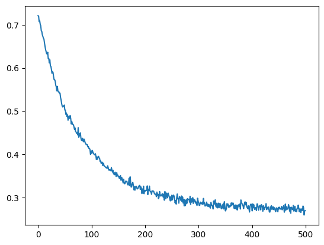
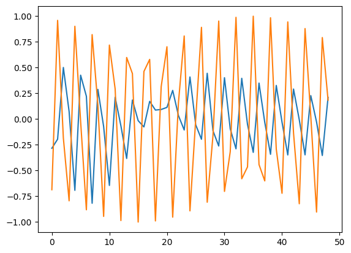
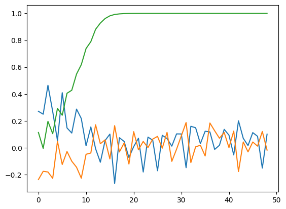
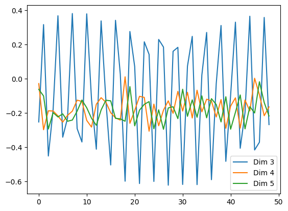
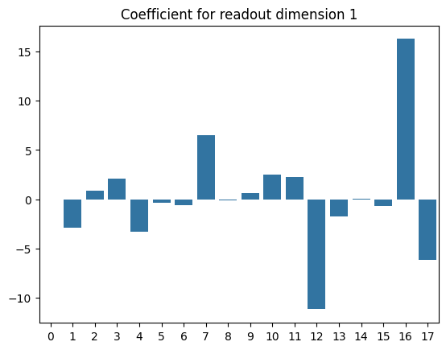

# 29/05/2024

*J'ai pu bénéfiecier de près de deux semaines vacances du 8 au 21 mai, et ça m'a fait beaucoup de bien !*

*Ce post va être assez long, et plein de graphique pour illustrer l'avancée de mes expériences. Bon courage ! ;P*

## Evo-topo (feat Naomi)

A mon retour Naomi a eu le temps de corriger et d'améliorer son code. Elle a aussi pu faire tourner 3 instances sur Plafrim allant à plus de 400 générations.

Elle m'a ensuite passé les données liés à ces instances que je puisse les analyser. 

### Fitness

Voici par exemple l'évolution de la fitness au cours des générations :


On observe notamment que notre meilleur individu toute génération confondue atteint une fitness de 69.5% pour 52 neurones.  
*Pour rappel Naomi obtient comme meilleur résultat un peu plus de 80% avec un réservoir de 500 neurones.* 

### Activité du meilleur invividu

On peut aussi s'intéresser à observer son activité. Pour cela j'ai réutilisé la méthode RSSViz du papier *"A journey in ESN and LSTM visualisations on a language task"* de Alexandre Variengien, Xavier Hinaut, et voici ce que l'on obtient :


Sur cette image, chaque point correspond à un état du réservoir observé sur un jeu de donnée servant à entrainer notre modèle de visualisation. Un état étant la sortie de chaque neurone à un instant donné pour un exemple donné. 

La couleur de chaque point corespond à la prédiction faite par le readout pour cet état du réservoir parmis les 4 classes possibles : A, B, C ou D. 

Les tracés correspondent à la trajectoire effectuée par l'état du réservoir au cours du temps pour quelques examples tirés aléatoirement. 

### Autres visualisations

J'ai aussi tenté d'autres analyses, notamment pour voir la répartition des individus et des espèces au fil des générations. Cela dit le résultat n'est pas très concluant pour le moment.  
*(Impossible de le présenter ici, le format vidéo n'étant pas autorisé).*

Je pense que nous pouvons aussi nous intéressé à regarder l'évolution du nombre de neurones, de la connexité des réseaux ou encore de la stabilité des topologies.

## Attention Unit Reservoir

Précédemment j'avais commencé à travailler sur un modèle de réservoir avec des unités d'attention. J'ai pu avancer sur ce sujet et j'ai maintenant un modèle plutôt fonctionnel, bien que toujours en évolution.

Je vais montrer ici quelques étapes de sa construction, notamment pour justifier certains choix et montrer certains tests. 

Pour l'ensemble des expériences suivantes, j'ai utilisé comme dataset 30.000 séquences numériques générées aléatoirements. Celles-ci se composent de 3 dimensions :
- Un cosinus avec une phase aléatoire
- Un sinus avec une phase aléatoire
- Du bruit gaussien

Nous remarquerons que ces trois dimensions sont totalement indépendantes, et que la troisième est un simple bruit, imprévisible par le modèle.

Voici le code utilisé pour générer ces séquences :

```python
def generate_sine_wave_data(seq_length, num_sequences):
    x = np.linspace(0, 100, seq_length)
    data = []
    for _ in range(num_sequences):
        sine_wave = np.sin(x + np.random.uniform(0, 2*np.pi))
        cosine_wave = np.cos(x + np.random.uniform(0, 2*np.pi))
        noise = np.random.normal(scale=0.1, size=seq_length)
        sequence = np.stack([sine_wave, cosine_wave, noise], axis=1)
        data.append(sequence)
    return np.array(data)

# Exemple d'utilisation
seq_length = 50  # Longueur de chaque séquence
num_sequences = 30000  # Nombre de séquences
dataset = generate_sine_wave_data(seq_length, num_sequences)
```

Voici un exemple de séquence générée :


### Step 1 : Premier résultat "cohérant"

Après avoir enfin réussi à vaincre Pytorch et ma stupidité, j'ai enfin pu réussir à obtenir un modèle fonctionnel, bien que pas très efficiant. 

Ici, et pendant prochaines étapes, le modèle est composés de 3 unités d'attention, chacune recevant les 3 signaux choisi aléatoirement parmis les 3 dimensions d'input, et les 9 (3x3) sorties de l'ensemble des unités d'attention.

> Loss Reservoir : 0.201  
> MSE Readout : 0.246

#### Evolution de la loss du reservoir



*Dans les étapes suivantes, je ne montrerai plus l'évolution de la loss, car elle est toujours très similaire à ce que l'on peut voir ici.*

#### Prédiction du modèle


Comme nous pouvons le voir, modèle semble avoir appris quelque chose, mais c'est encore très loin d'être intéressant.

Cela dit, nous pouvons noté qu'il a appris à prédire systématiquement 0 pour la troisième dimension. Etant donné que c'est un bruit gaussien centré sur 0, ceci est plutôt normal mais rassurant. 

*Dans les étapes suivantes, je ne montrerai plus la prédiction de la troisième dimension (le bruit), car elle sera toujours nulle.*

#### Activité des Units (Reservoir)


On peut voir que les unités semblent avoir appris à reproduire une partie de l'information des signaux d'entrée, et que les dimensions ne recevant pas directement de signaux d'entrée ont elles aussi appris "des choses". 

#### Memoire des Units

L'attention nécessite une fenêtre temporelle pour être calculée, pour ce fait chaque unité enregistre ses entrées dans une fenêtre glissante que j'appelle : sa mémoire (à court terme).  

La taille de cette fenêtre est arbitraire, mais déterminera fortement le nombre de calcul à effectuer pour chaque unité, car dans le calcul de l'attention, l'aspect quadratique s'applique sur la taille de la fenetre temporelle (le contexte).  

Il s'agit donc de trouver une taille suffisement grande pour capter l'information nécessaire, mais suffisement petite pour nécessité une faible puissance de calcul. Ici, j'ai choisi une fenêtre de 8 pas de temps.

Voici quelques exemples (sélectionnés) de mémoire :


*Dans les prochaines expériences, je ne montrerai plus la mémoire des unités, car elle est toujours très similaire à ce que l'on peut voir ici.*

### Step 2 : Application de tanh avant le readout

Dans certaines situations où une sortie d'une unité se rebranche sur elle-même, ou lors de la création de circuit dans le réseaux, certaines unités pouvaient voir une ou plusieurs de leurs dimensions croitre continuellement de manière linéaire. 

Pour corriger ceci, j'ai décidé d'appliquer une fonction tanh sur la sortie de chaque unité avant de la passer au readout, de manière à contenir chacune des valeurs entre -1 et 1.

> Malheureusement, j'ai seulement noté que j'obtenais de meilleur résultat, sans noter les scores obtenus... Cela dit, les prédiction me semblaient plus cohérente.

#### Prédiction du modèle





### Step 3 : Tanh remplace LayerNorm

Dans l'implémentation de mes unités d'attention, j'ai reproduit le même mécanisme de normalisation que celui utilisé dans les transformers, à savoir la Layer Normalization.

Cependant, dans le cas où les dimensions sont faibles, la Layer Normalization peut devenir problématique, amenant de nombreuses configuration aux mêmes valeurs.  

J'ai donc décidé de remplacer la Layer Normalization par une simple fonction tanh. 

> Loss Reservoir : 0.240  
> MSE Readout : 0.153

Bien que la loss du reservoir soit plus importante, il semblerait que les informations qui y sont extraites soient plus intéressante pour le readout.

#### Prédiction du modèle


#### Activité des Units (Reservoir)




### Step 4 : L2 Regularization sur Readout + Units

J'ai ensuite décidé d'appliquer une régularisation L2 sur le readout et sur les unités. J'ai là aussi pu observer un gain conséquent !

> Loss Reservoir : 0.125
> MSE Readout : 0.139

#### Prédiction du modèle


#### Activité des Units (Reservoir)


### Step 5 : 6 Unités d'attention

J'ai ensuite décidé de doubler le nombre d'unités d'attention, pour voir si cela pouvait améliorer les performances du modèle.

> Loss Reservoir : 0.233
> MSE Readout : 0.112

#### Loss du Reservoir


Comme nous pouvons le voir, le Reservoir n'a pas fini de converger. Malgré tout, le readout semble avoir appris quelque chose d'intéressant.

#### Prédiction du modèle


#### Activité des Units (Reservoir)





#### Coefficients du readout


Ce n'est pas le meilleur des plots, mais nous pouvons voir ici l'important de chaque dimension du reservoir pour la prédiction de l'output.

J'avais peur que le readout ne s'intéresse qu'au dimensions recevant en input l'une des dimensions d'entrée du réseau (sinus, cosinus), mais il semble que ce ne soit pas le cas.   

Il semble que le readout trouve de l'information dans des dimensions qui ne sont pas directement liées à l'input !

### Step 6 : Optimisation simultanée de toutes les Units

C'était prévisible, si l'on ne choisit qu'une seule unité pour s'entrainer pour chaque batch de donnée, alors soit le temps d'entrainement grossit énormément avec le nombre d'unité, soit l'entrainement est stoppé avant que les unités atteignent leur potentiel maximal (comme ce fut le cas lors de l'étape 5). 

Lors de cette étape j'ai donc décidé d'essayer d'entrainer toutes les unités en même temps. Je ne m'attendais pas à un succès, bien au contraire, je pensais que mes unités d'attention n'arriverai jamais à converger si leur entrées (sortie des autres unités) changent simultanément.

Il semblerait que j'ai eu grandement tord !

> Loss Reservoir : 0.135  
> **MSE Readout : 0.029**

#### Prédiction du modèle


#### Activité des Units (Reservoir)


#### Coefficients du readout





### Step 7 : Optimisation simultanée plus intelligente ?

Je me suis posé la question de la problématique d'entrainer simultannée plusieurs unités connectées entre elle. Peut-être y a-t-il une perte à entrainer ces même unités en même temps.

Ainsi, lors de cette étape, j'ai essayé d'optimiser simultanément autant d'unité possibles non connectés, ayant les plus grosses loss possible. 

L'algo utilisé était le suivant (en pseudo-code) :

```
0. Faire une liste de toutes les unités et leur loss associée
1. Selectionner l'unité ayant la plus grosse loss
2. Supprimer de la liste cette unité et toutes les unités connectées à elle
3. Tant que la liste n'est pas vide, repartir à l'étape 1. 
4. Faire un pas d'optimisation pour toutes les unités sélectionnées
```

Initialement je pensais que la méthode suivante aurait été plus adapté pour entrainer nos unités d'attention, mais il semblerait que ce ne soit pas le cas.

> Loss Reservoir : 0.0988  
> MSE Readout : 0.0977

#### Prédiction du modèle


#### Activité des Units (Reservoir)


#### Coefficients du readout


## Summerschool

J'ai été admis à [Pl@ntAgroEco](https://sites.google.com/view/agroeco-summer-school-2024/home). Il faut encore que je valide mon inscription avant le 12 juin.


## Papers

Je n'ai pas lu de papier à proprement parler, seulement Ilya Sutskever a sélectionné 30 papiers qui selon lui sont les plus importants du domaine actuellement. Les voici :

[La bible selon Ilya Sutskever](https://arc.net/folder/D0472A20-9C20-4D3F-B145-D2865C0A9FEE)

