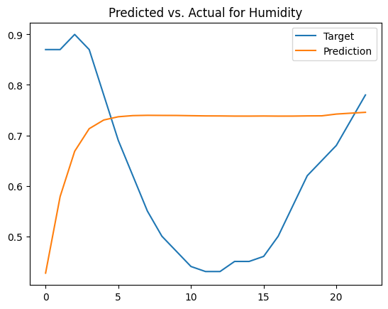

 # Rapport du 12/06/2024

## Evo-topo (feat Naomi)

Nous avons finalement obtenu des résultats intéressants ! Concrètement, nous rencontrions le problème suivant : nous utilisions des hyper-paramètres optimisés pour des réservoir de 50 ou 500 neuronnes, or nous démarrions notre population avec des individus composés d'un seul neurone. Les hyper-paramètres n'étant pas optimisé pour cette taille de réservoir, l'algo évolutionnaire rencontrait quelques problèmes.

Pour contourner ce problème, nous avons deux options : inclure les HP du réservoir (LR, IS, etc.) dans l'algorithme génétique (ce qui aurait pour effet d'augmenter considérablement le temps de calcul) ou commencer avec une population aléatoire d'individus composés de 50 neurones, pour lesquels nous connaissons déjà un ensemble d'HP optimisé, et essayer de conserver plus ou moins ce nombre de neurones lors de l'évolution.

Nous avons opté pour la seconde option. Nous obtenons plusieurs topologies différentes atteignant des performances proches des 80% de réussite. Cependant, deux topologies sortent du lot :

1. Une première où un neurone est connecté à presque tous les autres neurones du réservoir (une forme de neurone central) :

2. Une seconde très particulière, où **les neurones de la matrice W ne sont pas connectés entre eux !**. Au début, nous avons pensé à un bug, car sans connexion il est difficile pour le réseau d'obtenir une mémoire. Cependant, il semble que ce soit en réalité une solution particulière adaptée à notre tâche spécifique.

Je m'explique : la tâche consiste à présenter une fois deux stimuli parmi quatre, qui apparaissent dans deux positions aléatoires sur quatre et dans un ordre aléatoire sur 30 pas de temps. Le réseau reçoit donc principalement des zéros, et un 1 pour chaque stimulus lorsqu'il apparaît. Chaque stimulus a sa propre récompense associée, le but est de prédire quel stimulus parmi ceux vus lui apporte le plus de points. Il doit donc être capable de mémoriser le premier stimulus pour le comparer au second, et conserver ces informations jusqu'à la fin de la séquence.

Or, sans connexion dans la matrice W, on pourrait s'attendre à ce que le réseau ne soit pas capable de mémoriser le premier stimulus pour le comparer au second. Cependant, il semble que le réseau ait trouvé une solution alternative grâce à son Leaking Rate qui est très faible (0.1). Ainsi, les neurones peuvent être vus comme des "potentiels" à charger. Lorsqu'un stimulus apparaît, les neurones qui y sont connectés par la matrice W_in stockent la valeur reçue, puis la relâchent très lentement, perdant à chaque pas de temps 90% de l'information stockée. Ainsi, à la fin de la séquence, les neurones qui ont stocké l'information du premier et second stimulus sont encore légèrement chargés, et peuvent donc être comparer par le readout.

Un travail futur visant à identifier quels neurones sont connectés à l'entrée (W_in) et au readout (W_out) pourrait nous permettre de mieux comprendre ce qui se passe dans ce réseau. Et de mieux comprendre les choix des connexions que fait l'algorithme génétique.

## ForwardAnarchistUnits

J'ai mis à jour le modèle en ajoutant un feedback et la possibilité de configurer les dimensions des entrées, sorties, et unités d'attention selon nos besoins. Pour le feedback, étant donné que nous entraînons d'abord le réservoir puis le readout, nous ne pouvons pas prévoir à l'avance les valeurs que le readout donnera au réservoir en feedback, j'ai donc été obligé de proposer un teacher comme dans ReservoirPy. Pour ce faire, nous utilisons la sortie attendue par le readout, donc le Y d'entraînement. Cependant, cela ne fonctionne pas très bien, probablement parce qu'il y a un écart entre le feedback réel une fois entraîné et le teacher.

### SequentialMnist

*Le but de cette tâche est de donner au modèle chaque pixel de l'image un par un et de lui demander de prédire le chiffre de l'image (et donc de classifier l'image).*

Les résultats sont décevants, nous obtenons 11% de réussite, alors que l'aléatoire en donnerait 10%. Cependant, avec une recherche d'HP ces performances pourraient monter, mais cela prendrait beaucoup de temps. On peut notamment voir qu'un réservoir de 200 neurones, une fois ses HP optimisés, arrive à 40% de réussite (testé).

### Données Météorologiques

Concernant les données météorologiques, j'ai récupéré le dataset sur Kaggle et sélectionné toutes les colonnes numériques (`['Temperature (C)', 'Humidity', 'Wind Speed (km/h)', 'Wind Bearing (degrees)', 'Visibility (km)', 'Pressure (millibars)']`). J'obient alors plusieurs millier de séquence, chacune représentant un jour (24 relevés), et ayant 6 features. 

J'ai essayé d'apprendre au modèle à prédire chacune de ces features (simultannément) au temps t+1 à partir du temps t et de l'état du modèle. Ainsi, le modèle reçoit en entrée un vecteur de 6 dimensions et doit prédire un vecteur de 6 dimensions.

Les résultats sont intéressants, **mais présentent un problème majeur** : il y a un temps de retard. Ce qui est quand même problématique lorsque l'on cherche à prédire t+1 à partir de t, car on prédit t à partir de t, et ce n'est pas très efficace. On peut le vérifier en calculant la MSE de nos prédictions avec X[t] et Y=X[t+1], et on observe que Mean Squared Error avec Y est de 0.0126 alors que Mean Squared Error avec X est de: 0.0054.

Cela se vérifie avec ces plots :

Bref, petite déception. Mais, lorsque l'on compare avec ce qu'un LSTM est capable de faire sur ces mêmes données météorologiques, on relativise un peu vu que la MSE que nous obtenons est de 0.0589 et que les plots ressemblent à ceci :

(À noter qu'on avait près de 2.5 fois plus de paramètres pour le LSTM que pour notre modèle.)

Dans ce cas spécifique, il semblerait que nous soyons gagnants, mais dans l'ensemble je pense que le LSTM est plus polyvalent. J'ai en effet réussi à obtenir des résultats quasiment parfaits sur nos sinus/cosinus avec un LSTM :

MSE : 0.00924

Et d'autres personnes ont déjà évalué les LSTM classiques avec la tâche séquentialMNIST et obtiennent 98% de réussite.

Ainsi, notre modèle semble avoir réussi à battre le LSTM dans un cas de figure très particulier : des données météorologiques (chaotiques). Même s'il est à noter que nos prédictions se rapprochent plus de l'entrée que de la sortie attendue. Il semblerait donc qu'il y ait tout de même quelques bonnes idées dans notre méthode, sinon nous n'aurions probablement zéro résultats.

Or, la méthode d'apprentissage utilisée (en deux temps) est un peu particulière, et probablement sous-optimale. L'architecture de notre réseau lui semble intéressante, avec des blocks d'attentions reliés de manière récurrente et une couche de sortie qui se connecte à tous les blocks d'attention.

À l'avenir, peut-être serait-il intéressant de tester de l'entraîner avec une full-backpropagation.

## RecurrentAttentionNetwork

Dans le projet RecurrentAttentionNetwork, nous allons essayer de conserver la précédente architecture et reprendre un système d'apprentissage plus classique : la back-prop. Pour ce faire, notre readout devient un layer dense classique, qui propage son erreur aux blocks d'attentions. Et nos blocs d'attention ne sont plus entrainé à prédire leur entrée à t+1, mais son directement connecté au readout via la backpropagation et essais donc d'optimiser la même loss, celle de la tâche à accomplir.

Étant donné que nous allons faire face au problème du vanishing gradient, nous allons utiliser la Backpropagation Through Time (BPTT) pour entraîner notre modèle, et nous allons utiliser un paramètre pour définir le nombre d'étape maximum pour lequel nous calculerons le gradient. Ainsi, selon ce paramètre, nous entrainerons notre modèle récurrent à avoir de grande dépendance temporelle ou non.

## Présentation réunion d'équipe

Lors de cette réunion, j'ai tenté un nouveau format plus "débat". L'idée était de proposer (sans trop de préparation) un sujet qui me semblait intéressant et de laisser les autres membres de l'équipe réagir. Ici, le sujet choisi a été le projet BattleFieldAgents que j'ai fais il y a un an où des agents GPT4 devaient coopérer entre eux dans un jeu vidéo pour atteindre la victoire.

J'ai été très satisfait du déroulement de cette réunion, j'ai eu l'impression d'avoir réussi à capter l'intérêt des autres et que les débats étaient assez animés. J'espère que nous pourrons renouveler ce format à l'avenir.

## Summerschool

J'ai été admis à ILCB et je suis actuellement dans le processus de confirmation de mon inscription.

## Papers

- [TransformerFAM: Feedback attention is working memory (2024)](https://arxiv.org/pdf/2404.09173)

Ce papier présente TransformerFAM, une nouvelle architecture de Transformer qui permet à l'attention de s'appliquer à la fois aux données homogènes et aux représentations latentes via une boucle de rétroaction. Cette modification de l'architecture favorise naturellement l'émergence de la mémoire de travail au sein des Transformers. Pendant l'inférence, TransformerFAM a une complexité computationnelle de O(L) et une complexité mémoire de O(1), où L est la longueur des jetons traités. Les expériences montrent que TransformerFAM améliore significativement les performances des Transformers sur les tâches de long contexte, quel que soit la taille du modèle (1B, 8B, 24B).

- [Distributed Representations, Simple Recurrent Networks, and Grammatical Structure (1991)](https://link.springer.com/content/pdf/10.1007/BF00114844.pdf)

Ce papier présente un réseau de neurones récurrents simples (SRN) entraîné sur des phrases multiclausales contenant des relatives clauses multiplement imbriquées. L'analyse des patterns d'activation des unités cachées révèle que le réseau résout la tâche en développant des représentations distribuées complexes qui encodent les relations grammaticales et la structure hiérarchique des constituants.