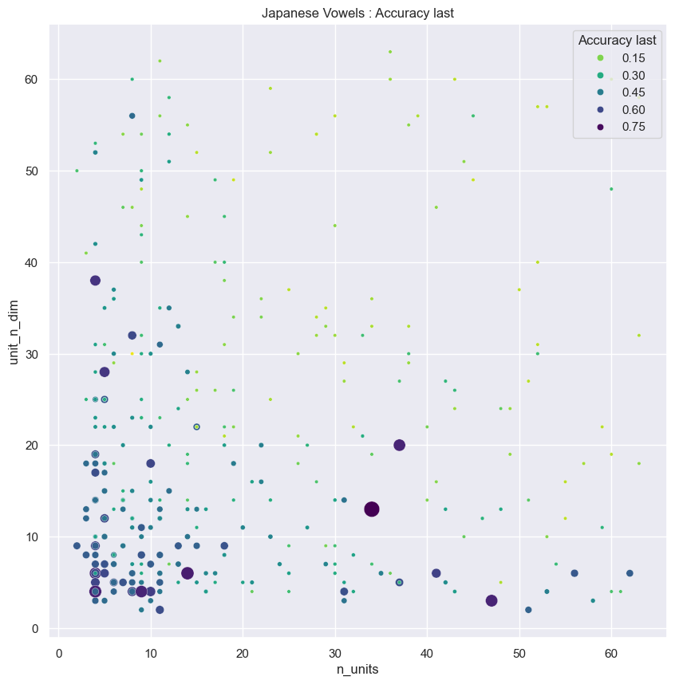
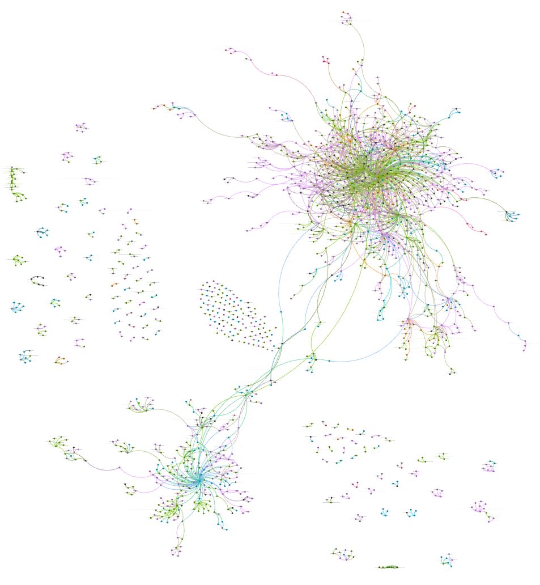

# 18/07/2024

## Forward Anarchist Units (FAU)

### Lorenz

J'ai essayé très succintement (sans optimisation des HPs) d'apprendre à un modèle FAU de prédire le temps t+1 de séries de lorenz en 3 dimension avec des paramètres initiaux aléatoires. 

Le modèle semble réussir à prédire le temps t+1 : on a une plus petite MSE pour le temps t+1 que pour le temps t (ses inputs). Malgré tout, on peut observer par cet exemple qu'il y a encore une marge d'erreur :

### Sequential MNIST

Pour cette tâche, un FAU basique ne permettait pas d'obtenir de quelconque résultat. J'ai donc dû faire une recherche d'hyper-paramètres, le problème étant que chaque run peut s'avérer être très long, sequentialMNIST étant une tâche assez gourmande (784 pas de temps). 

Ainsi, la recherche a été très longue, et je n’ai réussi à faire que 51 runs. La meilleur précision que j'ai obtenu est de 25.1% (là où l’aléatoire ferait 10%). 

### Japanese Vowels

Là aussi, j'ai dû réalisé une recherche d'HPs, seulement la tâche est bien plus simple. 

Ainsi, j’ai pu lancé sans grande difficulté plus de 300 runs. La meilleur précision que j'ai obtenu est de 77.0% (là où l’aléatoire ferait 11.1%).

Mais surtout très heureux du plot qui suit, qui semble montrer deux choses :
1. Nous obtenons de meilleur score lorsque les unités possèdent un petit nombre de dimension.
2. Les meilleurs scores ont été obtenu par des modèles possédant de nombreuses unités. 

### Conclusion

Les résultats ne sont pas hyper convainquant, mais au moins les modèles semblent apprendre quelque chose. 

## Recurrent Attention Network (RAN)

### Implementation done

### Test on sin/cos

### Test on others

## Stage Virgile

### Deploiment vLLM, embeddings, website sur Plafrim

> **Petit rappel**  
>
> Pour les besoins du stage de Virgile, nous avons fait la demande d'avoir un accès exclusif à un noeud Sirocco de Plafrim pendant la durée de son stage. Aussi incroyable cela puisse être, on nous a dit oui !  
>
>Ainsi, nous avons à notre disposition une machine possèdant deux GPU V100 16Go, permettant de faire tourner des LLMs (de relativement petite taille) avec vLLM en un temps record !

Sur cette machine, j'ai donc mis en place 3 services :
- un serveur LLM (via vLLM)
- un serveur pour les embeddings (via Transformers de HuggingFace)
- un serveur pour le site web (via Panel en python, dev par Virgile)

J'ai donc mis en place et déployer avec screen ces trois services sur le noeud Sirocco de Plafrim. Grâce à cela, Virgile a pu avoir accès à ces services avec un simple tunnel SSH.

Puis, avec Loic, nous avons déployer ces services avec systemctl, et Loic a créer une config nginx nous permettant d'exposer le site web sur l'adresse : [http://chat.reservoirpy.inria.fr/](http://chat.reservoirpy.inria.fr/).

L'ensemble des commandes permettant d'installer et de lancer ces services sont disponible dans le Notes suivant : [Stage Virgile : Mise en place de la machine](https://notes.inria.fr/bHJzSAfwRTmnC0moRj-Y_w).

### Simple RAG

Pour aider virgile à se lancer, et aussi pour m'amuser un peu, j'ai développé rapidement un petit RAG spécialisé sur la ville d'Eysines en python. Les résultats ne sont pas exeptionnels, mais on observe une nette amélioration avec le RAG. 

#### Exemple sans RAG

> Q : What can i do in Eysines ?  

> A : Eysines is a charming commune located in the Haute-Savoie department of France, nestled in the Auvergne-Rhône-Alpes region. While it's a small town, there are still some interesting activities and attractions to explore. Here are a few ideas:
>1. **Hiking and outdoor activities**: Eysines is surrounded by beautiful countryside, offering numerous hiking trails with breathtaking views of the surrounding mountains and valleys.
>2. **Visit the Church of Saint-Martin**: This 12th-century church is a notable landmark in Eysines, featuring stunning stained-glass windows and ornate stone carvings.
>3. **Explore the local markets**: Every Saturday morning, the town hosts a bustling market selling fresh produce, artisanal goods, and local specialties like cheese, bread, and charcuterie.
>4. **Wine tasting**: The region around Eysines is famous for its wine production, particularly whites made from Chardonnay and Sauvignon grapes. Visit local vineyards or wineries to taste some of the best vintages.
>5. **Relax at a café or restaurant**: Enjoy a leisurely meal or coffee at one of the town's cozy cafes or restaurants, many of which serve traditional Savoyard cuisine like tartiflette, crozets, and raclette.
>6. **Take a day trip to Annecy**: Only about 30 minutes away by car, the picturesque town of Annecy is known for its canals, historic old town, and stunning mountain views.
>7. **Go skiing or snowshoeing**: In winter, nearby ski resorts like La Clusaz, Manigod, and Le Grand Bornand offer excellent skiing and snowboarding opportunities.
>8. **Attend local festivals**: Eysines hosts various festivals throughout the year, such as the Fête de la Transhumance in September, which celebrates traditional cattle herding practices.
>
>These are just a few ideas to get you started. Depending on your interests and the time of year you visit, there may be other activities or events worth exploring in Eysines.

#### Exemple avec RAG

> As Eysines is a part of the Bordeaux metropolitan area, you'll have access to many attractions and activities in Bordeaux! Here are some suggestions:
>
>- Visit the famous Cité du Vin wine museum, which offers wine tastings and educational workshops.  
>- Explore the historic center of Bordeaux, including the Place de la Bourse, the Cathedral of Saint Andrew, and the Grand Théâtre.  
Take a stroll along the Garonne River and enjoy the city's scenic views.  
>- Visit the Musée d'Aquitaine, which features exhibits on the history and culture of Aquitaine.  
Go shopping at the Galeries Lafayette or the Capitole department store.  
>-  Enjoy the city's vibrant nightlife by visiting bars, clubs, and live music venues in the Saint-Pierre district.  
Take a wine tour or visit one of the many vineyards in the surrounding region.  
> 
>Keep in mind that Eysines is a smaller town located just outside of Bordeaux, so you may need to take public transportation or drive to reach some of these attractions.  

### GraphRag

Parmis les papiers de recherche publié récemment sur les RAG, on peut notamment cité celui qui introduit la méthode GraphRag :

[From Local to Global: A Graph RAG Approach to Query-Focused Summarization](https://arxiv.org/pdf/2404.16130)

Ce papier introduit l'idée d'utiliser des LLM (encoder et decodeur) pour extraire d'un ensemble de texte des concepts. Ces derniers peuvent être très divers et variés : personne, lieu, objet, action, etc. Puis, grâce aux informations présentes dans les documents, de les associer à des résumés, de les liés entre eux, et enfin de les regrouper par famille.  
L'idée étant que nous pouvons alors créer une Graphe composé de l'ensemble de ces concepts et de leur relations, permettant alors de plus facilement trouver les documents adéquats pour répondre à la demande de l'utilisateur question.

Virgile a lancé GraphRag sur l'ensemble de ses documents collectés pour reservoirPy, et voici le graph que nous obtenons :

**Lien DL file** (il faut zoom pour lire les concepts et leur liens)

**Idée comme ça :**  
Ca pourrait être intéressant de faire un GraphRag pour l'équipe Mnemosyne. Ca donnerai une image de l'ensemble des concepts que nous avons abordé, et de leur relations.   

Je voulais faire ça, j'ai donc télécharger tous les papiers Mnémosyne que j'ai pu via HAL (300+). Mais je crains que ça demande un temps de calcul non négligeable !

## Autres

### Cross Situational Learning (CSL)

Alexis Juven, un ancien stagiaire de l'équipe, a travaillé sur un projet de CSL en python2. J'ai repris une partie de son code et j'ai remis le projet à jour en python3.
J'en ai profiter pour rendre la création du dataset un peu plus modulable pour l'utilisateur. 

Cela dit, il manque encore la fonctionnalité permettant de différencier les erreurs exactes des erreurs valides.

[Github pour générer un dataset CSL](https://github.com/Naowak/CrossSituationalLearning)

### Bernstein Application

Nous avons pu rédigé un abstract à propos des FAU et RAN et le soummettre. Nous attendons notre acceptation ou non. Cependant, nous savons que nous ne pouvons pas bénéficier de "tarifs réduits" pour accéder à la conférence (impossible de devenir membre : il faut en connaître 2). Ce qui, compte tenu du budget, réduit fortement les chances d'y aller.

### Papier DAN

Le papier avec DAN a pas mal avancé. Les parties Abstract, Introduction, Objectifs, Pré-requis et Expériences sont déjà rédigé. Il me reste à rédiger les parties Resultats, Discussion et Conclusion. 

[Lien vers les notes de rédaction](https://notes.inria.fr/DAf_w4kESDaIOqBTZi_U0Q)

### Cours à donner

Il est prévu que je sois en charge d'un groupe de TD en M1 informatique à l'Université de Bordeaux et un groupe de TP en M2 Science Cognitive à l'ENSC. Dans les deux cas, il s'agira de cours sur l'IA.

Les référants sont respectivement Akka Zemmari et Guillaume Maucort.