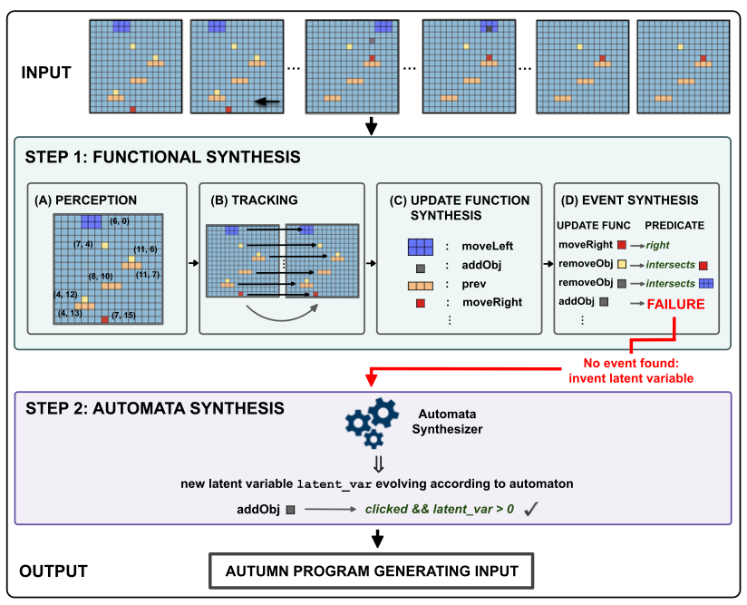

### -Combining Functional and Automata Synthesis to Discover Causal Reactive Programs (2023)

[Paper](https://dl.acm.org/doi/pdf/10.1145/3571249)

Le document "Combining Functional and Automata Synthesis to Discover Causal Reactive Programs" présente une nouvelle approche pour la synthèse de programmes réactifs causaux, combinant la synthèse fonctionnelle et d'automates. Voici une synthèse structurée en plusieurs parties et sous-parties :

1. **Introduction et Concepts Clés**
   - Présentation du contexte et des objectifs du projet.
   - Explication des concepts de base du langage de programmation Autumn et de l'algorithme AutumnSynth.

2. **Méthodologie de Synthèse**
   - Description des différentes étapes de l'algorithme AutumnSynth :
     - **Perception** : Identification des types d'objets et instances.
     - **Suivi d'Objets** : Suivi des changements des objets dans le temps.
     - **Synthèse de Fonctions de Mise à Jour** : Création de fonctions décrivant les changements des objets.
     - **Synthèse de Causes** : Identification des événements déclencheurs des fonctions de mise à jour.

3. **Application et Évaluation**
   - Application de l'algorithme sur des exemples concrets.
   - Évaluation de la performance et de l'efficacité de l'algorithme.

4. **Discussion et Conclusion**
   - Analyse des implications des résultats.
   - Perspectives futures pour la recherche dans ce domaine.

