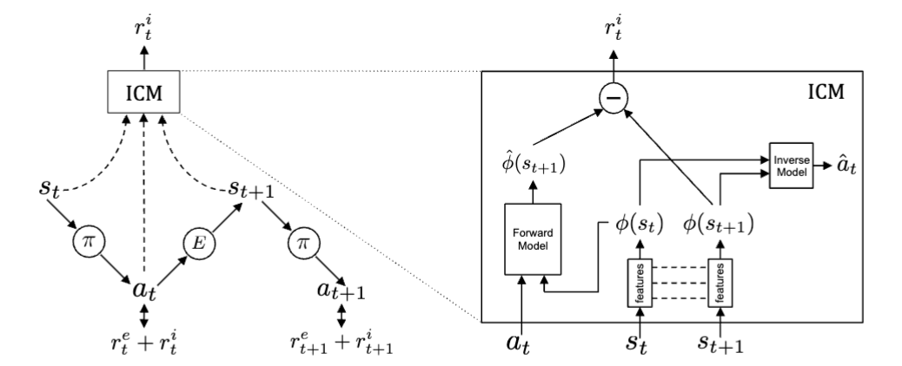

### Curiosity-driven Exploration by Self-supervised Prediction (2017)

[paper](https://pathak22.github.io/noreward-rl/resources/icml17.pdf)

1. **Problématique** : Comment encourager l'exploration dans les environnements d'apprentissage par renforcement où les récompenses extrinsèques sont rares ou absentes.
  
2. **Solution Proposée** : Utiliser la curiosité comme récompense intrinsèque en plus de la récompense extrinsèque.

3. **Curiosité Formulée** : L'erreur dans la prédiction des conséquences des actions de l'agent dans un espace de caractéristiques visuelles : soit l'erreur de la prediction d'un encodage de $s_{t+1}$. 

4. **Espace de Caractéristiques** : Transforme $s_t$ en un espace où seule l'information pertinente à l'action est représentée.

5. **Deux Sous-systèmes** :
   - Générateur de récompenses intrinsèque : Produit une récompense basé sur la curiosité.
   - Politique : Génère des actions pour maximiser la récompense intérinsèque + extrinsèque. 

6. **Modèle d'Inverse Dynamique** : Prédit l'action basée sur l'état actuel ($s_t$) et l'état suivant ($s_{t+1}$).

7. **Modèle de Dynamique Avant** : Prédit l'encodage de l'état suivant $s_{t+1}$ à partir de l'état actuel $s_t$ et de l'action $a_t$. L'erreur de prédiction est la récompense intrinsèque.

8. **Résultat Principal** : En utilisant la curiosité au sein de sa récompense, l'agent est encouragé à explorer efficacement des environnements complexes.

