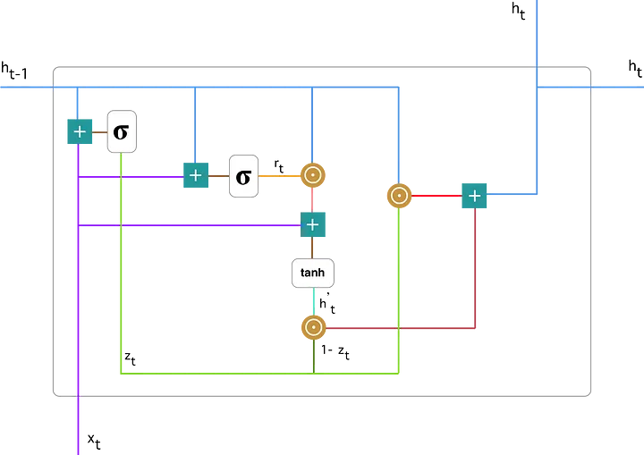

### GRU : Learning Phrase Representations using RNN Encoder–Decoder for Statistical Machine Translation (2014)

[Paper](https://arxiv.org/pdf/1406.1078v3.pdf)

1. **Objectif**:
    - Proposer un nouveau modèle de réseau neuronal appelé RNN Encoder-Decoder qui peut encoder une séquence de symboles en une représentation vectorielle de longueur fixe et décoder cette représentation en une autre séquence de symboles.
    - Utiliser ce modèle pour améliorer la performance des systèmes de traduction automatique statistique.
2. **RNN Encoder-Decoder**:
    - Composé de deux réseaux neuronaux récurrents (RNN) : un encodeur et un décodeur.
    - L'encodeur mappe une séquence source de longueur variable en un vecteur de longueur fixe.
    - Le décodeur mappe le vecteur en une séquence cible de longueur variable.
    - Les deux réseaux sont entraînés conjointement pour maximiser la probabilité conditionnelle de la séquence cible étant donné une séquence source.
3. **Gates:**
    - **Gates**: Le GRU est doté de mécanismes de "gates" pour contrôler le flux d'information. Ces "gates" permettent au modèle de décider quelle information est pertinente à conserver ou à oublier à chaque étape temporelle. Plus précisément, le GRU utilise deux "gates" principaux :
    - **Reset Gate**: Il détermine comment combiner les nouvelles entrées avec les informations précédentes.
    - **Update Gate**: Il décide quelle portion de l'information précédente doit être conservée ou oubliée.
    - **Fonctions d'activation**: Les fonctions sigmoid et tanh sont utilisées dans le GRU. La fonction sigmoid, qui produit des valeurs entre 0 et 1, est utilisée pour les "gates", permettant ainsi de moduler l'information. La fonction tanh, qui produit des valeurs entre -1 et 1, est utilisée pour transformer les données, en ajoutant une non-linéarité qui aide à capturer des dépendances complexes.
4. **Unité cachée adaptative**:
    - Propose une nouvelle unité cachée inspirée de l'unité LSTM mais plus simple à calculer.
    - Utilise des "gates" pour contrôler l'information qui est conservée ou oubliée à chaque étape.
5. **Application en traduction automatique statistique**:
    - Le modèle est formé sur une table de paires de phrases.
    - Une fois formé, le modèle est utilisé pour noter chaque paire de phrases dans une table de phrases pour un système de traduction automatique statistique.
    - L'approche de notation des paires de phrases avec le RNN Encoder-Decoder améliore la performance de la traduction.
6. **Résultats et conclusions**:
    - Le modèle RNN Encoder-Decoder est évalué sur la tâche de traduction de l'anglais vers le français.
    - Il est montré que le modèle apprend une représentation continue d'une phrase qui préserve à la fois la structure sémantique et syntaxique de la phrase.
    - L'analyse qualitative montre que le RNN Encoder-Decoder est meilleur pour capturer les régularités linguistiques dans la table de phrases, ce qui explique les améliorations quantitatives de la performance globale de traduction.

**Attention** : Deux différentes versions (équivalente) existent. L’une applicant le 1 - z_t au terme h^_t , l’autre au terme h_t-1.  

C’est équivalent car z_t est compris entre 0 et 1, c’est donc le réseau qui s’adapte.