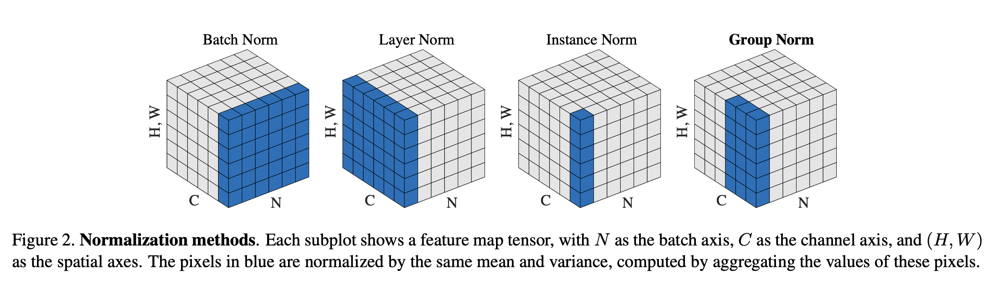

### Group Normalization (2018)

[Paper](https://arxiv.org/pdf/1803.08494.pdf)

### Introduction
- **Batch Normalization** : BN est une méthode clé dans le développement du deep learning, en particulier pour les réseaux très profonds. Elle normalise les fonctionnalités par la moyenne et la variance calculées au sein d'un mini-lot, ce qui facilite l'optimisation et la convergence des réseaux très profonds.
- **Problématiques avec BN** : BN présente des problèmes lorsque la taille du lot devient petite, ce qui conduit à une augmentation rapide de l'erreur due à l'estimation inexacte des statistiques du lot. Cette limitation affecte l'usage de BN pour la formation de modèles plus importants et le transfert de fonctionnalités vers des tâches de vision par ordinateur nécessitant de petits lots.

### Group Normalization (GN)
- **Présentation de GN** : GN est une alternative simple à BN. Contrairement à BN, GN divise les canaux en groupes et calcule la moyenne et la variance pour la normalisation au sein de chaque groupe. GN est indépendant de la taille des lots et sa précision est stable sur une large gamme de tailles de lots.
- **Fondements de GN** : GN s'inspire des caractéristiques de représentation en groupe dans les réseaux neuronaux, où chaque groupe de canaux peut être construit par un type d'histogramme ou une orientation. Cela permet une normalisation groupée efficace et significative.
- **Relation avec d'autres travaux** : GN est lié à la Layer Normalization (LN) et à l'Instance Normalization (IN), mais offre une meilleure puissance de représentation et est moins restrictif. GN se transforme en LN ou IN en ajustant le nombre de groupes.

### Expérimentations et Résultats
- **Classification d'images sur ImageNet** : Sur le dataset ImageNet, GN montre une erreur inférieure de 10.6% par rapport à BN pour des lots de taille 2. Pour des tailles de lots typiques, GN est presque aussi bon que BN et surpasse les autres variantes de normalisation.
- **Adaptabilité aux petites tailles de lots** : GN est moins sensible à la taille des lots que BN, conservant une performance robuste même avec des lots très petits, ce qui le rend adapté pour des modèles nécessitant de grandes capacités de mémoire.
- **Comparaison avec Batch Renormalization** : GN surpasse Batch Renormalization (BR), particulièrement pour des petites tailles de lots.
- **Flexibilité de la division en groupes** : GN fonctionne bien pour un large éventail de configurations de groupes, démontrant sa flexibilité et son efficacité.
- **Performance sur des modèles plus profonds** : GN est comparé à BN sur ResNet-101, montrant une performance stable et robuste même avec de petites tailles de lots.
- **Analyses sur les modèles VGG** : Sur les modèles VGG, GN est légèrement supérieur à BN, suggérant que GN pourrait être plus efficace pour certains types de réseaux.

### Applications Pratiques
- **Détection d'objets et segmentation dans COCO** : GN améliore la performance par rapport à BN* (BN gelé) dans les tâches de détection d'objets et de segmentation sur le dataset COCO, en particulier lors de l'utilisation de lots de petite taille.
- **Classification vidéo dans Kinetics** : Dans des tâches de classification vidéo sur Kinetics, GN démontre une forte compétitivité par rapport à BN, en particulier pour des configurations de lots plus petits.

### Conclusion et Travaux Futurs
- **Implications de GN** : GN est présenté comme une couche de normalisation efficace sans exploiter la dimension de lot, démontrant sa polyvalence dans diverses applications. Des études futures pourraient explorer l'application de GN dans d'autres domaines comme le RNN/LSTM et les modèles génératifs.

