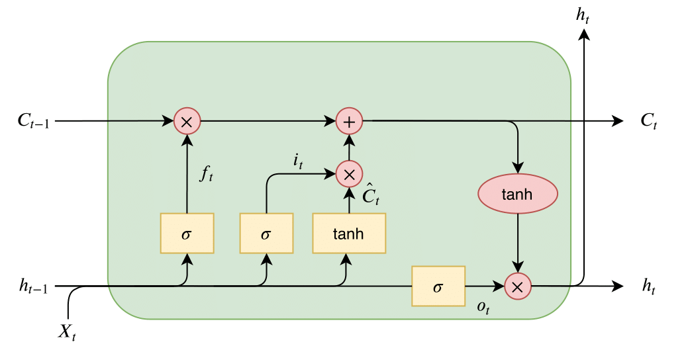

### Long Short Term Memory (1997)

[Paper](https://www.researchgate.net/publication/13853244_Long_Short-term_Memory)

LSTM est une avancée majeure dans le domaine des réseaux de neurones récurrents, offrant une solution robuste aux limitations des RNN classiques et permettant des performances améliorées sur de nombreuses tâches nécessitant une mémoire à long terme.

1. **Raisons de la création de LSTM** :
    - **Problème du gradient qui s'évapore** : Les réseaux de neurones récurrents (RNN) classiques ont du mal à apprendre des dépendances à long terme à cause du problème d'évaporation (ou explosion) du gradient. Lors de la rétropropagation, les gradients peuvent devenir extrêmement petits et tendre vers zéro (ou devenir extrêmement grands et exploser), rendant l'apprentissage inefficace ou instable.
    - **Gestion des dépendances à long terme** : Les tâches nécessitant une mémoire des informations sur de longues séquences nécessitent une architecture capable de maintenir et d'accéder à cette mémoire sur de longues périodes.
2. **Avantages par rapport aux RNN classiques** :
    - **Mémoire à long terme** : Grâce à ses mécanismes de portes, LSTM peut apprendre et se souvenir d'informations sur de plus longues séquences que les RNN classiques.
    - **Résolution du problème d'évaporation du gradient** : L'architecture de LSTM est conçue pour éviter le problème d'évaporation du gradient, permettant un apprentissage stable même sur de longues séquences.
3. **Particularités architecturales** :
    - **Porte d'oubli (Forget Gate)** : Décide de la quantité d'information à jeter ou à conserver de la cellule mémoire. Utilise la fonction sigmoïde pour produire des valeurs entre 0 (tout oublier) et 1 (tout retenir).
    - **Porte d'entrée (Input Gate)** : Met à jour la cellule mémoire avec de nouvelles informations. Se compose de deux parties : une utilisant la sigmoïde pour décider quelles valeurs mettre à jour, et une utilisant la tanh pour créer une version vectorisée des nouvelles informations.
    - **Porte de sortie (Output Gate)** : Décide quelle valeur sortir de la cellule mémoire, basée sur l'état caché actuel et les informations actuelles de la cellule mémoire. Utilise la fonction sigmoïde pour décider quelle partie de la mémoire afficher.
4. **Utilisation des fonctions sigmoïde et tanh** :
    - **Sigmoïde** : Produit des valeurs entre 0 et 1, ce qui est utile pour prendre des décisions binaires, comme ouvrir/fermer une porte ou oublier/conserver des informations.
    - **Tanh** : Produit des valeurs entre -1 et 1, ce qui est utile pour réguler les valeurs dans la cellule mémoire, en garantissant que les valeurs restent dans une plage contrôlée.

