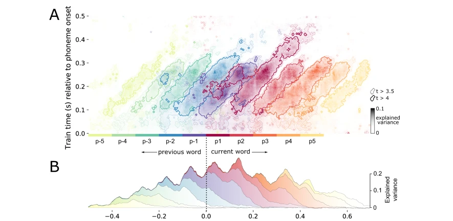

### Neural dynamics of phoneme sequences reveal position-invariant code for content and order

[Paper](https://www.nature.com/articles/s41467-022-34326-1)

Ce document traite de la manière dont le cerveau humain traite et séquence les sons de la parole. 

1. **Introduction et Contexte** :
   - La parole est constituée d'un signal acoustique en constante évolution. Cependant, les auditeurs humains la perçoivent comme des séquences de sons de parole discrets, utilisés pour reconnaître des mots discrets.
   - Les analyses montrent que le cerveau encode en continu les trois sons de parole les plus récemment entendus en parallèle.
   - Chaque représentation sonore évolue avec le temps, codant à la fois ses caractéristiques phonétiques et le temps écoulé depuis son début.
   - Les représentations sont actives plus tôt lorsque les phonèmes sont plus prévisibles et sont maintenues plus longtemps lorsque l'identité lexicale est incertaine.

2. **Méthodologie** :
   - Les réponses neuronales ont été enregistrées avec la magnétoencéphalographie (MEG) pendant que 21 participants écoutaient quatre courtes histoires.
   - Chaque phonème de l'histoire a été annoté pour son timing, sa position dans le mot, ainsi que ses propriétés phonétiques et statistiques.

3. **Résultats** :
   - Les caractéristiques phonétiques étaient décodables en moyenne entre 50 et 300 ms à partir du signal MEG.
   - Les informations théoriques telles que la surprise, l'entropie et la fréquence de séquence log ont été décodées.
   - Les propriétés positionnelles telles que la position dans le mot ont expliqué une grande partie de la variance.
   - Le cerveau traite plusieurs phonèmes simultanément, avec une durée moyenne de décodabilité d'environ 300 ms.
   - Les représentations des caractéristiques phonétiques sont invariantes par rapport à la position, ce qui signifie que le cerveau utilise une représentation qui ne dépend pas de la position du phonème dans un mot.

