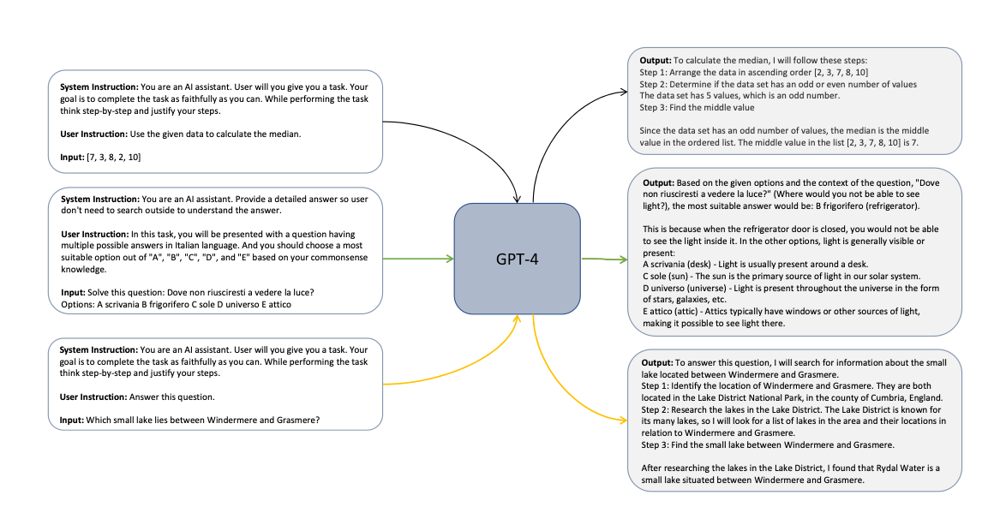
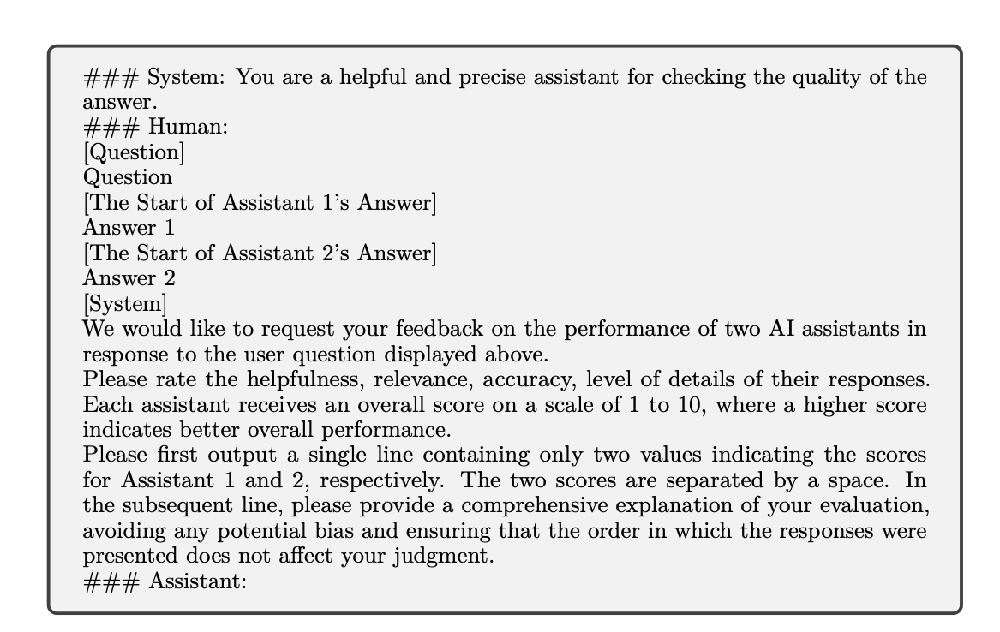

### Orca: Progressive Learning from Complex Explanation Traces of GPT-4 (2023)

[Paper](https://arxiv.org/pdf/2306.02707.pdf)

Le papier intitulé "Orca: Progressive Learning from Complex Explanation Traces of GPT-4" se penche sur l'amélioration des capacités des modèles plus petits en utilisant l'apprentissage par imitation basé sur les sorties générées par de grands modèles de fondation (LFMs). Voici les points clés du document :

1. **Objectif principal** : Le but est de développer Orca, un modèle de 13 milliards de paramètres, qui apprend à imiter le processus de raisonnement des LFMs (Large Foundation Models). Orca apprend à partir de données riches de GPT-4, y compris des traces d'explication, des processus de réflexion étape par étape, et d'autres instructions complexes, guidé par l'assistance d'un enseignant à partir de ChatGPT.

2. **Défis des méthodes existantes** :
   - Les méthodes actuelles d'imitation ont des limitations en termes de diversité des tâches, de complexité des requêtes et d'échelle des données.
   - Les données d'imitation sont limités car ils reposent principalement sur des paires de requêtes et de réponses générées par le modèle enseignant.
   - Les évaluations précédentes des modèles plus petits étaient limitées et ont souvent surestimé leurs capacités par rapport aux LFMs.

3. **Contribution clé - Tuning d'explication** : 
   - Orca utilise le "tuning d'explication" où, en plus des paires de requêtes et de réponses, des réponses détaillées de GPT-4 sont utilisées pour expliquer le processus de raisonnement du modèle enseignant.
   - Des instructions système sont utilisées pour obtenir de telles explications, fournissant ainsi des données d'apprentissage supplémentaires (explain like i'm 5, step by step, etc).

4. **Évaluation** :
   - Orca est évalué sur une gamme de paramètres pour ses capacités génératives, de raisonnement et de compréhension.
   - Il est testé sur des benchmarks académiques, des examens professionnels et académiques, et des évaluations de sécurité.
   - Des études de cas sont fournies pour comparer les capacités de génération et de raisonnement d'Orca avec d'autres LFMs comme ChatGPT et GPT-4.

5. **Résultats notables** :
   - Orca surpasse les modèles conventionnels tels que Vicuna-13B dans des benchmarks de raisonnement complexe en zero-shot comme BigBench Hard et AGIEval.
   - Il atteint la parité avec ChatGPT sur le benchmark BigBench Hard et montre une performance compétitive dans des examens professionnels et académiques comme le SAT, LSAT, GRE, et GMAT.

6. **Conclusion** : L'apprentissage à partir d'explications étape par étape, qu'elles soient générées par des humains ou des modèles d'IA plus avancés, est une direction prometteuse pour améliorer les capacités et les compétences des modèles.

