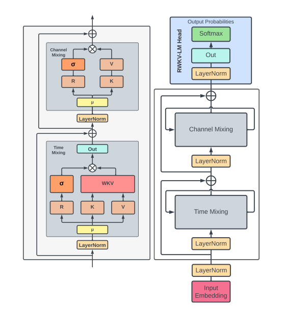

### RWKV : Reinventing RNNs for the Transformer Era (2023)

[Paper](https://arxiv.org/pdf/2305.13048.pdf)

Le papier intitulé "RWKV: Reinventing RNNs for the Transformer Era" propose une nouvelle architecture de modèle, appelée Receptance Weighted Key Value (RWKV). Cette architecture vise à combiner les avantages des Transformers et des RNNs tout en évitant leurs inconvénients respectifs. Voici un résumé détaillé du papier en mettant l'accent sur les points que vous avez mentionnés :

1. **Problématique** :
    - Les Transformers ont révolutionné presque toutes les tâches de traitement du langage naturel (NLP) mais souffrent d'une complexité mémoire et computationnelle qui évolue de manière quadratique avec la longueur de la séquence.
    - Les RNNs, quant à eux, présentent une évolution linéaire en termes de mémoire et de besoins computationnels, mais ils peinent à égaler les performances des Transformers en raison de limitations en matière de parallélisation et de mise à l'échelle.
2. **RWKV - Une Solution Hybride** :
    - L'architecture RWKV est conçue pour combiner l'entraînement parallélisable efficace des Transformers avec l'inférence efficace des RNNs.
    - Elle utilise une mécanique d'attention linéaire, permettant de formuler le modèle soit comme un Transformer, soit comme un RNN.
    - Cela permet des calculs parallélisés pendant l'entraînement et maintient une complexité computationnelle et mémoire constante pendant l'inférence.
    - Le RWKV est la première architecture non-transformer à être mise à l'échelle pour des dizaines de milliards de paramètres.
3. **Attention Additive** :
    - Contrairement aux Transformers qui utilisent une matrice Q pour l'attention, RWKV remplace cette matrice par un vecteur W.
    - Ce vecteur est multiplié par une position négative décroissante, ce qui est différent de l'attention utilisée dans les Transformers.
4. **Architecture RWKV** :
    - **Time Mixing** : RWKV utilise x(t-1) et x(t) avec une constante μ pour réaliser une interpolation linéaire.
    - **Channel Mixing** : Cette partie de l'architecture traite des interactions entre les différents canaux ou caractéristiques.
    - L'architecture est conçue pour être à la jonction entre un RNN et un Transformer, ce qui permet d'avoir toujours la même computation pour l'inférence.
5. **Avantages et Limitations** :
    - **Avantages** :
        - RWKV peut être parallélisé comme un Transformer, ce qui est bénéfique pour l'entraînement.
        - Il présente une complexité linéaire, ce qui le rend plus efficace pour traiter de longues phrases.
        - Il utilise une fonction sigmoid comme "forget gate".
        - Le modèle est spécifiquement conçu pour le traitement du langage et utilise une couche d'embedding au début.
        - Il offre une stabilité du gradient.
    - **Limitations** :
        - L'attention linéaire peut ne pas être suffisante pour certaines tâches.
        - Les prompts longs peuvent devenir moins pertinents car RWKV ne peut pas se référer à tous les mots du prompt, mais à un état global calculé.
        - L'attention est additive dans le temps, mais multiplicative au moment présent.
        - Il ne peut pas avoir une attention qui prend en compte les mots suivants, seulement les mots précédents.
6. **Conclusion** :
    - RWKV représente une étape significative vers la réconciliation des compromis entre l'efficacité computationnelle et la performance du modèle dans les tâches de traitement de séquences. Il offre une solution prometteuse pour gérer des tâches impliquant de grands modèles avec des milliards de paramètres, tout en offrant des performances compétitives à une fraction du coût computationnel.

Ce résumé fournit une vue d'ensemble détaillée du papier en se concentrant sur les points clés que vous avez mentionnés. Il met en évidence la motivation derrière RWKV, son fonctionnement, ses avantages, ses limitations, et sa pertinence dans le domaine du traitement du langage naturel.

