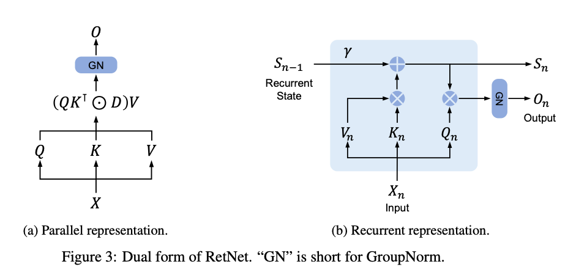

### Retentive Network: A Successor to Transformer for Large Language Models (2023)

[Paper](https://arxiv.org/pdf/2307.08621.pdf)
[Explanation](https://medium.com/ai-fusion-labs/retentive-networks-retnet-explained-the-much-awaited-transformers-killer-is-here-6c17e3e8add8)
[GitHub](https://github.com/Jamie-Stirling/RetNet)

- **RetNet** : Proposé comme une architecture de base pour les grands modèles de langage, RetNet vise à atteindre le parallélisme lors de l'entrainement, une inférence à faible coût et de bonnes performances. Il établit une connexion théorique entre la récurrence et l'attention et introduit un mécanisme de rétention pour la modélisation de séquences.

- **Mécanismes de Computation** : RetNet supporte trois paradigmes de calcul : parallèle, récurrent et récurrent par chunks. La représentation parallèle permet le parallélisme d'entrainement, la représentation récurrente permet une inférence à faible coût O(1), et la représentation récurrente par chunks facilite la modélisation efficace de longues séquences avec une complexité linéaire.

- **Performances** : Les résultats expérimentaux montrent que RetNet offre des résultats de mise à l'échelle favorables, une formation parallèle, un déploiement à faible coût et une inférence efficace, se positionnant comme un successeur potentiel du Transformer pour les grands modèles de langage.

- **Comparaison avec Transformer** : RetNet est comparé avec le Transformer et ses variantes, montrant que RetNet est compétitif en termes de courbes de mise à l'échelle et d'apprentissage en contexte. Il offre également une inférence à coût invariant par rapport à la longueur de la séquence.

- **Architecture de RetNet** : L'architecture de RetNet est composée de blocs identiques empilés, contenant un module de rétention multi-échelle (MSR) et un réseau feed-forward (FFN). Le MSR remplace l'attention multi-têtes et utilise différents paramètres pour chaque tête.

- **Comparaison avec d'autres méthodes** : RetNet est comparé à d'autres méthodes telles que S4, l'attention linéaire et RWKV, montrant des avantages en termes de complexité de mémoire pour les longues séquences et de performance.

- **Expériences** : Des expériences sur la modélisation du langage évaluent RetNet, avec des benchmarks sur la performance de modélisation du langage et du zero/few-shot learning sur des tâches en aval. RetNet montre des avantages en termes de vitesse, de consommation de mémoire et de latence pendant la formation et l'inférence.

