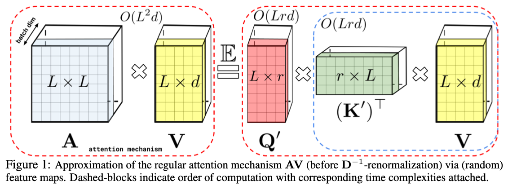

### Rethinking Attention with Performers (2022)

[Paper](https://arxiv.org/pdf/2009.14794.pdf)

### Introduction
- **Contexte** : Les Transformateurs sont des architectures de réseaux neuronaux de pointe dans plusieurs domaines, mais ils souffrent d'une complexité spatiale et temporelle quadratique, limitant leur applicabilité à de grandes séquences.
- **Problématique** : Cette complexité élevée limite l'utilisation des Transformateurs dans des contextes avec des ressources computationnelles limitées.

### Performers : Une Nouvelle Architecture
- **Introduction des Performers** : Les Performers sont une nouvelle architecture de Transformateur qui estime l'attention régulière (softmax) de manière précise tout en ayant une complexité linéaire en espace et en temps.
- **Mécanisme FAVOR+** : Ils utilisent un mécanisme nommé Fast Attention Via positive Orthogonal Random (FAVOR+) pour approximer efficacement les noyaux softmax et Gaussiens.
- **Compatibilité et Garanties Théoriques** : Les Performers sont pleinement compatibles avec les Transformateurs réguliers et offrent des garanties théoriques solides comme une estimation non biaisée ou presque non biaisée de la matrice d'attention.

### Applications et Expériences
- **Utilisations Diverses** : FAVOR+ peut modéliser des mécanismes d'attention au-delà du softmax, utiles en vision par ordinateur, apprentissage par renforcement et optimisation combinatoire.
- **Expériences** : Des expériences sur diverses tâches montrent que les Performers sont compétitifs par rapport à d'autres méthodes d'attention efficaces.

### Implications Techniques
- **Complexité Réduite** : Les Performers atteignent une efficacité proche de l'optimal en termes de vitesse et de consommation de mémoire, en particulier pour de grandes valeurs de L (taille de la séquence d'entrée).
- **Erreurs d'Approximation** : Il est démontré que les caractéristiques orthogonales et positives réduisent l'erreur d'approximation de l'attention softmax.
- **Compatibilité en Arrière** : Les Performers sont compatibles avec les modèles Transformateurs pré-entraînés, nécessitant parfois un faible ajustement.

### Applications et Impact
- **Biologie et Médecine** : Potentiel d'impact significatif dans l'analyse de séquences biologiques, y compris la prédiction des interactions protéiques.
- **Environnement** : Réduction des coûts de calcul et de la consommation d'énergie, se traduisant par une diminution des émissions de CO2.
- **Recherche sur les Transformateurs** : Les résultats peuvent influencer la recherche sur des architectures de Transformateurs efficaces et étendre leur portée au-delà de leur champ d'application actuel.
- **Compatibilité en Arrière** : L'intégration avec les Transformateurs pré-entraînés existants est une caractéristique importante, rendant les Performers attrayants pour les praticiens.

