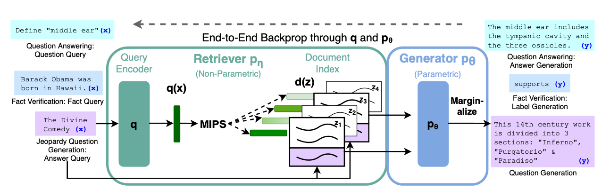

### Retrieval-Augmented Generation for Knowledge-Intensive NLP Tasks (2021)

[paper](https://arxiv.org/pdf/2005.11401.pdf)

Le papier intitulé "Retrieval-Augmented Generation for Knowledge-Intensive NLP Tasks" explore une recette de fine-tuning générale pour la génération augmentée par récupération (RAG). L'idée principale est d'utiliser des modèles qui combinent une mémoire paramétrique pré-entraînée (LLM) et une mémoire non paramétrique pour la génération de langage.  
Ces modèles RAG utilisent une mémoire paramétrique sous la forme d'un modèle seq2seq pré-entraîné et une mémoire non paramétrique sous la forme d'un index vectoriel dense de Wikipedia, accessible via un récupérateur neuronal pré-entraîné.  
Ainsi, la mémoire non paramétrique a pour rôle d'aller chercher dans sa base de données vectoriel les documents permettant de répondre au mieux à l'entrée $x$. Ces documents $z$ sont ensuite concaténé à $x$ (dans le prompt) pour permettre au LLM de bien répondre.

Deux formulations RAG sont comparées :
1. **RAG-Sequence** : le modèle utilise les mêmes passages récupérés pour l'ensemble de la séquence générée.
2. **RAG-Token** : le modèle peut utiliser différents passages pour chaque token généré.

Pour encoder une requête à partir de $x$, ils utilisent BERT pour obtenir $ q(x) $. De même, pour obtenir une représentation des documents, ils utilisent $ d(z) $ qui est également basé sur BERT. La probabilité de récupération est donnée par $ p_\eta(z|x) $.

L'erreur utilisée pour entraîner le modèle est la différence de log-vraisemblance entre $y$ généré et $y$ attendu.

En résumé, ce papier propose une méthode pour améliorer la capacité des grands modèles de langage à accéder et à manipuler précisément les connaissances en combinant la mémoire paramétrique et non paramétrique. Cette approche a montré des améliorations significatives dans diverses tâches NLP axées sur la connaissance.

