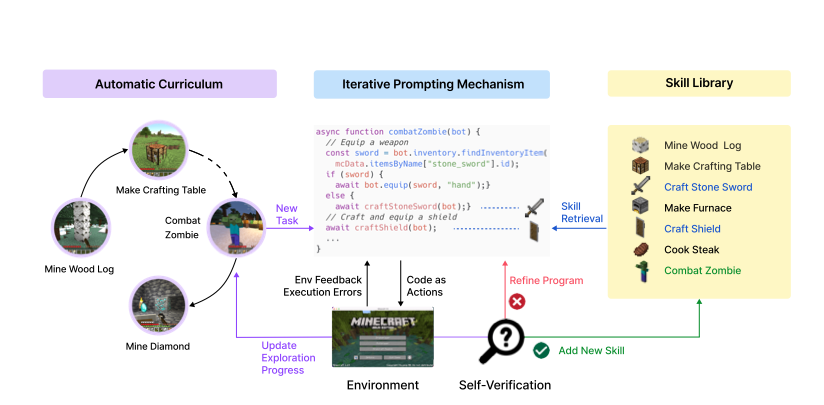
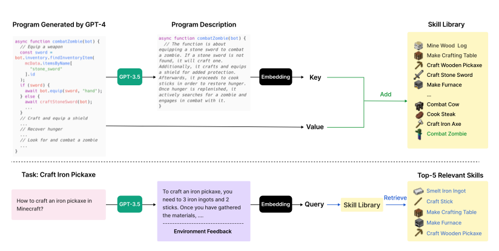
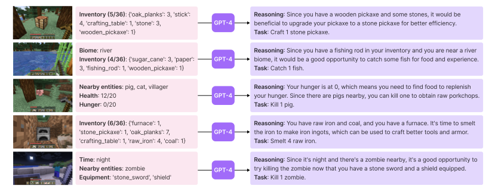

### VOYAGER An Open-Ended Embodied Agent with Large Language Models (2023)

[Paper](https://arxiv.org/pdf/2305.16291.pdf)

Le document "VOYAGER: An Open-Ended Embodied Agent with Large Language Models" explore un agent d'apprentissage continu dans l'environnement de jeu Minecraft, utilisant des modèles de langage comme GPT-4 pour le contrôle. Voici une synthèse structurée du document :

1. **Introduction et Contexte**
   - Présentation de l'agent d'apprentissage continu, VOYAGER, utilisant GPT-4 dans Minecraft.
   - Discussion sur les défis et les objectifs de l'apprentissage continu dans des mondes ouverts.

2. **Composantes Clés de VOYAGER**
   - Description des trois composantes principales : un curriculum automatique, une bibliothèque de compétences, et un mécanisme d'interpellation itératif.
   - Explication de l'utilisation de GPT-4 pour la génération de code et la prise de décision.

3. **Méthodologie et Expérimentation**
   - Détails sur la configuration expérimentale et les paramètres de simulation dans Minecraft.
   - Comparaison avec d'autres techniques basées sur des modèles de langage.

4. **Résultats et Analyses**
   - Présentation des performances de VOYAGER, notamment en termes de découverte d'objets, de maîtrise de l'arbre technologique, et d'exploration de cartes.
   - Évaluation de la généralisation à des tâches inédites et la capacité d'apprentissage continu.

5. **Limitations et Perspectives**
   - Discussion sur les coûts, les inexactitudes et les hallucinations dans les réponses de GPT-4.
   - Perspectives d'amélioration et d'application dans d'autres domaines.

