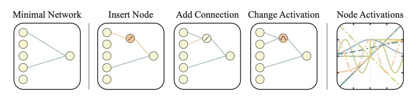
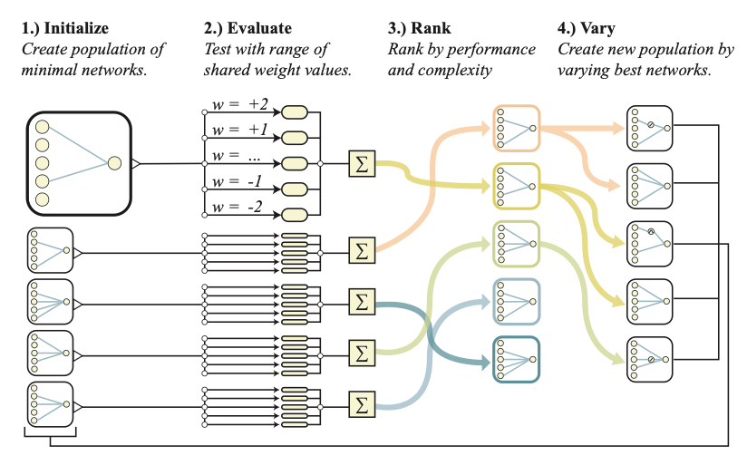

### Weight Agnostic Neural Networks (2019)

[Paper](https://arxiv.org/pdf/1906.04358.pdf)

Le document "Weight Agnostic Neural Networks" explore comment la structure d'un réseau neuronal peut influencer ses performances indépendamment des poids spécifiques utilisés dans le réseau.

1. **Introduction et Concept Clé**
   - Présentation de l'idée que les architectures de réseaux neuronaux peuvent être efficaces même avec des poids aléatoires.
   - Examen des capacités intrinsèques des réseaux sans entraînement des poids.

2. **Recherches Connexes**
   - Discussion sur les travaux précédents dans les domaines de l'apprentissage profond et les réseaux neuronaux évolutionnaires.
   - Relation avec les théories et techniques existantes, y compris l'importance des architectures de réseau dans divers contextes.

3. **Méthodologie de Recherche de Réseau Neuronal Agnostique au Poids**
   - Description du processus de recherche d'architectures de réseaux pouvant fonctionner avec un seul poids partagé.
   - Détails sur la méthode d'évaluation des architectures et les critères de performance.

4. **Résultats Expérimentaux**
   - Analyse des performances des architectures trouvées dans différents domaines, notamment le contrôle continu et la classification.
   - Comparaison avec les réseaux traditionnels formés sur les mêmes tâches.

5. **Discussion et Perspectives d'Avenir**
   - Réflexions sur les implications et les applications potentielles de cette recherche.
   - Suggestions pour de futures recherches dans le domaine des réseaux neuronaux et de l'apprentissage automatique.

